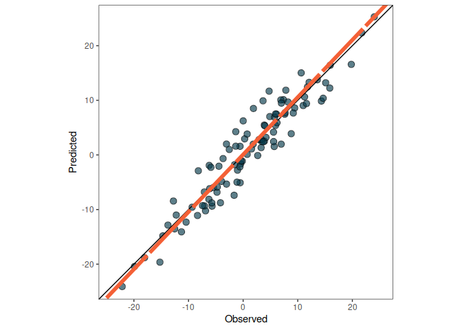
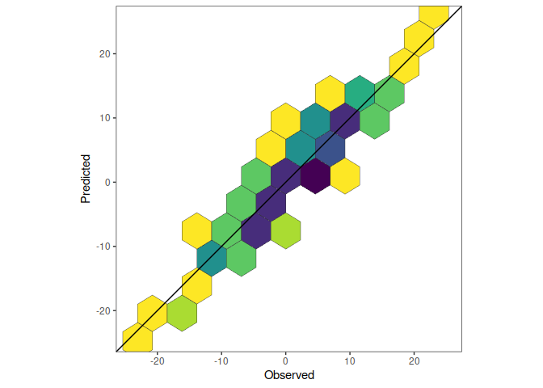
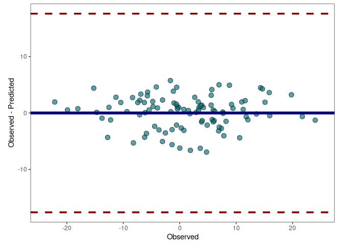

<!-- README.md is generated from README.Rmd. Please edit that file -->

# metrica

<!-- badges: start -->

[](https://app.travis-ci.com/github/adriancorrendo/metrica)
[](https://ci.appveyor.com/project/adriancorrendo/metrica)
[](https://codecov.io/gh/adriancorrendo/metrica?branch=master)

<!-- badges: end -->

The goal of the *metrica* package is to offer users of point-forecast
models a complete toolbox with error metrics accounting for different
aspects of the agreement between predicted and observed values.


## Installation

You can install the released version of metrica from
[CRAN](https://CRAN.R-project.org) with:

``` r
install.packages("metrica")
```

And the development version from [GitHub](https://github.com/) with:

``` r
# install.packages("devtools")
devtools::install_github("adriancorrendo/metrica")
```

## Example

This is a basic example which shows you core functions of *metrica*:

``` r
library(metrica)
# Seed for reproducibility
set.seed(1)
X <- rnorm(n = 100, mean = 0, sd = 10)
Y <- X + rnorm(n=100, mean = 0, sd = 3)

# Data frame
example.data <- data.frame(obs = X, pred = Y)

# Create scatter plot with OP orientation
scatter.plot(obs = example.data$obs, pred = example.data$pred,
             orientation = "PO")
```



``` r
# Create tiles plot with PO orientation
tiles.plot(obs = example.data$obs, pred = example.data$pred,
           bins = 15, orientation = "PO")
```



``` r
# Create a Bland-Altman plot
bland.altman.plot(example.data$obs, example.data$pred)
```



``` r
# Estimate coefficient of determination (R2)
metrica::R2(obs = example.data$obs, pred = example.data$pred)
#> [1] 0.8974817

# Estimate RMSE
metrica::RMSE(obs = example.data$obs, pred = example.data$pred)
#> [1] 2.861482

# Estimate MBE
metrica::MBE(obs = example.data$obs, pred = example.data$pred)
#> [1] -0.1134242

# Estimate metrics summary
metrica::metrics.summary(obs = example.data$obs, pred = example.data$pred)
#> # A tibble: 36 × 2
#>    Metric    value
#>    <chr>     <dbl>
#>  1 B0       0.0650
#>  2 B1       1.05  
#>  3 R2       0.897 
#>  4 CCC      0.951 
#>  5 MAE      2.28  
#>  6 MAPE   543.    
#>  7 SMAPE   55.5   
#>  8 RAE      0.320 
#>  9 RSE      0.103 
#> 10 MBE     -0.113 
#> # … with 26 more rows
```

## Metrics available in *metrica*

The **metrica** package contains +40 functions . Most of them work with
only two arguments: `observed`(a.k.a. actual, measured, truth, target)
and `predicted` (a.k.a. simulated, fitted) values. For now, included
functions cover the world of “regression error” metrics (i.e. prediction
performance for continuous variables). Classification error metrics
coming soon. <b/>

| Metric      | Definition                                                                          | Details | Formula |
|-------------|-------------------------------------------------------------------------------------|---------|---------|
| 1\. B0      | Intercept of SMA regression                                                         | Use     | Formula |
| 2\. B1      | Slope of SMA regression                                                             | Use     | Formula |
| 3\. R2      | Coefficient of determination                                                        | Use     | Formula |
| 4\. CCC     | Concordance correlation coefficient                                                 | Use     | Formula |
| 5\. MAE     | Mean Absolute Error                                                                 | Use     | Formula |
| 6\. MAPE    | Mean Absolute Percentage Error                                                      | Use     | Formula |
| 7\. SMAPE   | Symmetric Mean Absolute Percentage Error                                            | Use     | Formula |
| 8\. RAE     | Mean Absolute Error                                                                 | Use     | Formula |
| 9\. RSE     | Mean Absolute Error                                                                 | Use     | Formula |
| 10\. MBE    | Mean Bias Error                                                                     | Use     | Formula |
| 11\. PBE    | Percentage Bias Error                                                               | Use     | Formula |
| 12\. PAB    | Percentage Absolute Error                                                           | Use     | Formula |
| 13\. PPB    | Percentage Proportional Bias                                                        | Use     | Formula |
| 14\. MSE    | Mean Squared Error                                                                  | Use     | Formula |
| 15\. RMSE   | Root Mean Squared Error                                                             | Use     | Formula |
| 16\. RSE    | Relative Squared Error                                                              | Use     | Formula |
| 17\. RRMSE  | Relative Root Mean Squared Error                                                    | Use     | Formula |
| 18\. RSR    | Root Mean Standard Deviation Ratio                                                  | Use     | Formula |
| 19\. iqRMSE | Inter-quartile Normalized Root Mean Squared Error                                   | Use     | Formula |
| 20\. MLA    | Mean Lack of Accuracy. Correndo’s MSE decomposition. Correndo et al. (2012)         | Use     | Formula |
| 21\. MLP    | Mean Lack of Precision Correndo’s MSE decomposition. Correndo et al. (2012)         | Use     | Formula |
| 22\. PLA    | Percentage Lack of Accuracy                                                         | Use     | Formula |
| 23\. PLP    | Percentage Lack of Precision                                                        | Use     | Formula |
| 24\. *MSEs* | Systematic Mean Squared Error. Willmott’s MSE decomposition. Willmott et al. (1985) | Use     | Formula |
| 25\. *MSEu* | Mean Squared Unsystematic. Willmott’s MSE decomposition. Willmott et al. (1985)     | Use     | Formula |
| 26\. SB     | Squared Bias. Kobayashi and Salam’s decomposition                                   | Use     | Formula |
| 27\. SDSD   | Product of Standard Deviations. Kobayashi and Salam’s decomposition                 | Use     | Formula |
| 28\. LCS    | Lack of Correlation. Kobayashi and Salam’s decomposition                            | Use     | Formula |
| 29\. Ue     | Random error proportion. Theils’ partial inequalities                               | Use     | Formula |
| 30\. Uc     | Lack of Consistency. Theils’ partial inequalities                                   | Use     | Formula |
| 31\. Ub     | Bias error proportion. Theils’ partial inequalities                                 | Use     | Formula |
| 32\. NSE    | Nash and Sutcliffe’s Model Efficiency. Nash and Sutcliffe (1970)                    | Use     | Formula |
| 33\. E1     | Absolute Model Efficiency.                                                          | Use     | Formula |
| 34\. Erel   | Relative Model Efficiency. Krause et al. (2005)                                     | Use     | Formula |
| 35\. KGE    | Kling-Gupta Model Efficiency. Kling et al. (2012)                                   | Use     | Formula |
| 36\. *d*    | Index of Agreement. Willmott et al. (1983)                                          | Use     | Formula |
| 37\. d1     | Absolute Index of Agreement. Willmott et al. (1985)                                 | Use     | Formula |
| 38\. RAC    | Robinson’s Agreement Coefficient. Robinson (1957)                                   | Use     | Formula |
| 39\. AC     | Ji and Gallo’s Agreement Coefficient. Ji and Gallo (2006)                           | Use     | Formula |
| 40\. lambda | Duveiller’s lambda Coefficient. Duveiller et al. (2015)                             | Use     | Formula |
