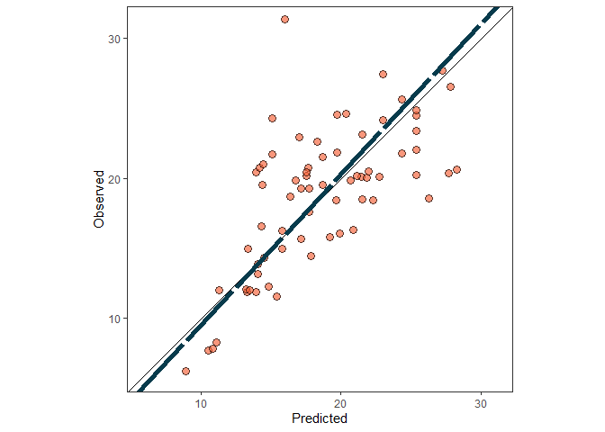
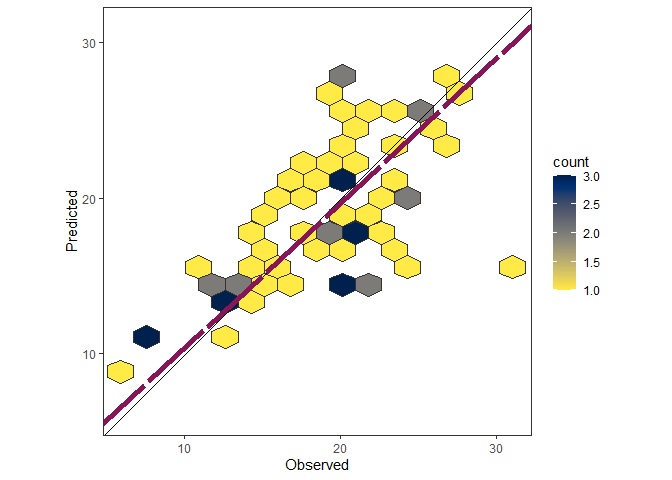
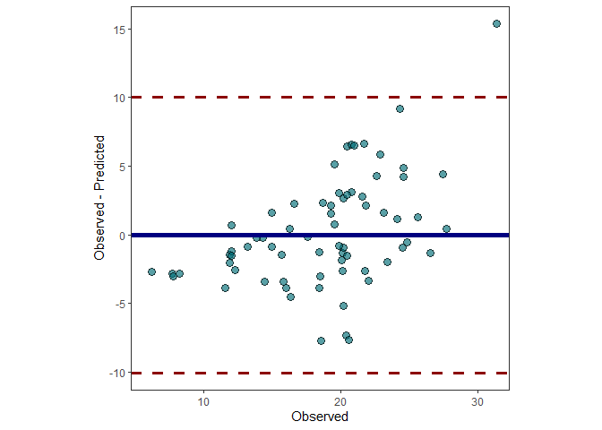

<!-- README.md is generated from README.Rmd. Please edit that file -->

# metrica: Prediction performance metrics.

<!-- badges: start -->

[](https://ci.appveyor.com/project/adriancorrendo/metrica)
[](https://github.com/adriancorrendo/metrica/actions)
[](https://zenodo.org/badge/latestdoi/414721777)
[](https://app.codecov.io/gh/adriancorrendo/metrica)
<!-- badges: end -->

The goal of the *metrica* package is to offer users of point-forecast
models a toolbox with a wide spectrum of goodness of fit and error
metrics (+40) accounting for different aspects of the agreement between
predicted and observed values. Also, some basic visualization functions
to assess models performance (e.g. scatter with regression line;
Bland-Altman plot) are provided in customizable format (ggplot).


<br/>

This package contains +40 functions. Two arguments are always required:
`observed`(Oi; a.k.a. actual, measured, truth, target) and `predicted`
(Pi; a.k.a. simulated, fitted) values. Also, there is an optional `data`
arg. that allows to call an existing data frame containing both observed
and predicted vectors. <br/>

Some functions, also require to define axis `orientation`, such as the
slope of linear regression describing the bivariate scatter. Current
included functions cover the world of “regression error” metrics
(i.e. prediction performance for continuous variables). Classification
error metrics coming soon. <br/>

Always keep in mind that predicted values should come from out-of-bag
samples (unseen by training set) to avoid overestimation of prediction
performance. <br/>

Check the Documentation at <https://adriancorrendo.github.io/metrica/>
<br/>

**Vignettes** <br/>

[1. Complete list of
metrics](https://adriancorrendo.github.io/metrica/articles/available_metrics.html)
<br/>

[2. A use
case](https://adriancorrendo.github.io/metrica/articles/vignette1.html)
<br/>

## 1. Installation

You can install the development version from
[GitHub](https://github.com/) with:

``` r
# install.packages("devtools")
devtools::install_github("adriancorrendo/metrica")
```

## 2. Native datasets

The *metrica* package comes with four example datasets from the APSIM
software: <br/> 1. `wheat`. 137 data-points of wheat grain N (grams per
squared meter) <br/> 2. `barley`. 69 data-points of barley grain number
(x1000 grains per squared meter) <br/> 3. `sorghum`. 36 data-points of
sorghum grain number (x1000 grains per squared meter) <br/> 4.
`chickpea`. 39 data-points of chickpea aboveground dry mass (kg per
hectare) <br/>

These data correspond to the latest, up-to-date, documentation and
validation of version number 2020.03.27.4956. Data available at:
<https://doi.org/10.7910/DVN/EJS4M0>. Further details can be found at
the official APSIM Next Generation website:
<https://APSIMnextgeneration.netlify.app/modeldocumentation> <br/>

## 3. Example Code

This is a basic example which shows you the core functions of *metrica*:

``` r
library(metrica)
library(dplyr)
library(purrr)
library(tidyr)
library(ggpmisc)

# 1. A. Create a fake dataset
# Set seed for reproducibility
set.seed(1)
# Create a random vector (X) with 100 values
X <- rnorm(n = 100, mean = 0, sd = 10)
# Create a second vector (Y) with 100 values by adding error with respect
# to the first vector (X).
Y <- X + rnorm(n=100, mean = 0, sd = 3)
# Merge vectors in a data frame, rename them as synonyms of observed (measured) and predicted (simulated)
example.data <- data.frame(measured = X, simulated = Y)

# 1. B. Or call native example datasets

example.data <- barley %>%  # or 'wheat', 'sorghum', or 'chickpea'
# 1.b. create columns as synonyms of observed (measured) and predicted (simulated)
                mutate(measured = obs, simulated = pred)  


# 2. Use metrica plot functions
# 2.a. Create scatter plot with PO orientation
barley.scat.plot <- metrica::scatter_plot(data = example.data, obs = measured, pred = simulated,
             orientation = "PO")
barley.scat.plot
```



``` r
# Alternative using vectors instead of dataframe
#metrica::scatter_plot(obs = example.data$obs, pred = example.data$pred)

# 2.b. Create tiles plot with OP orientation
barley.tiles.plot <- metrica::tiles_plot(data = example.data, obs = measured, pred = simulated,
           bins = 15, orientation = "OP")

barley.tiles.plot
```



``` r
# 2.c. Create a Bland-Altman plot
barley.ba.plot <- metrica::bland_altman_plot(data = example.data,
                           obs = measured, pred = simulated)

barley.ba.plot
```



``` r
# 3. Get metrics estimates
# 3.a. Single estimates
# 3.a.i. Estimate coefficient of determination (R2)

metrica::R2(data = example.data, obs = measured, pred = simulated)
#> [1] 0.4512998

# 3.a.ii. Estimate root mean squared error (RMSE)
metrica::RMSE(data = example.data, obs = measured, pred = simulated)
#> [1] 3.986028

# 3.a.iii. Estimate mean bias error (MBE)
metrica::MBE(data = example.data, obs = measured, pred = simulated)
#> [1] 0.207378

# 3.b. Metrics Summary 
metrics.sum <- metrica::metrics_summary(data = example.data, 
                                        obs = measured, pred = simulated)  
# Print first 15
head(metrics.sum, n = 15)
#>    Metric      Score
#> 1      B0  1.1282743
#> 2      B1  0.9288715
#> 3       r  0.6717885
#> 4      R2  0.4512998
#> 5      Xa  0.9963915
#> 6     CCC  0.6693644
#> 7     MAE  3.0595501
#> 8    RMAE  0.1629325
#> 9    MAPE 16.8112673
#> 10  SMAPE 16.7848032
#> 11    RAE  0.7639151
#> 12    RSE  0.6164605
#> 13    MBE  0.2073780
#> 14    PBE  1.1043657
#> 15    PAB  0.2706729

# Optional wrangling (WIDE)
metrics.sum.wide <- metrics.sum %>%
  tidyr::pivot_wider(tidyr::everything(),
                      names_from = "Metric",
                      values_from = "Score") 

# 4. Test multiple datasets at once
# 4.a. Create nested df with the native examples
nested.examples <- bind_rows(list(wheat = metrica::wheat, 
                                  barley = metrica::barley,
                                  sorghum = metrica::sorghum, 
                                  chickpea = metrica::chickpea), 
                             .id = "id") %>%
  dplyr::group_by(id) %>% tidyr::nest() %>% dplyr::ungroup()

head(nested.examples %>% group_by(id) %>% dplyr::slice_head(n=2))
#> # A tibble: 4 x 2
#> # Groups:   id [4]
#>   id       data              
#>   <chr>    <list>            
#> 1 barley   <tibble [69 x 2]> 
#> 2 chickpea <tibble [39 x 2]> 
#> 3 sorghum  <tibble [36 x 2]> 
#> 4 wheat    <tibble [137 x 2]>

# 4.b. Run 
multiple.sum <- nested.examples %>% 
  # Store metrics in new.column "performance"
  mutate(performance = map(data, ~metrica::metrics_summary(data=., obs = obs, pred = pred)))

head(multiple.sum)
#> # A tibble: 4 x 3
#>   id       data               performance  
#>   <chr>    <list>             <list>       
#> 1 wheat    <tibble [137 x 2]> <df [41 x 2]>
#> 2 barley   <tibble [69 x 2]>  <df [41 x 2]>
#> 3 sorghum  <tibble [36 x 2]>  <df [41 x 2]>
#> 4 chickpea <tibble [39 x 2]>  <df [41 x 2]>
```

## 4. Print metrics in a plot

``` r
df <- metrica::wheat

# B. Create list of selected metrics
selected.metrics <- c("MAE","RMSE", "RRMSE", "R2", "CCC", "KGE", "PLA", "PLP")

metrica::scatter_plot(data = df, obs = obs, pred = pred, print_metrics = TRUE, 
                      metrics_list = selected.metrics)
```


## 5. Import simulated data from APSIM Classic (.out) and APSIM NextGen (.db)

``` r
# Use import_apsim_out for APSIM Classic output
soybean.out <- metrica::import_apsim_out(filepath = "tests/testthat/examples/soybean.out")

# Use import_apsim_db for APSIM NextGeneration output
soybean.db <- metrica::import_apsim_db(filename = "soybean.example.db",  folder = "tests/testthat/examples/")

head(soybean.out)
#>   Date (dd/mm/yyyy) yield (kg/ha) biomass (kg/ha) grain_protein (%)
#> 1        16/05/2001        1449.8          2915.9            37.115
#> 2        10/05/2002        1092.5          2965.1            37.115
#> 3        23/04/2003        1368.9          3529.6            37.115
#> 4        26/04/2004        2121.6          4710.3            37.115
#> 5        09/05/2005        1950.3          4303.9            37.115
#> 6        20/04/2006        1670.6          3806.6            37.115
#>   GrainN (g/m^2) lai (m^2/m^2) oilGrainN (g/m^2) grain_oil_conc (%)
#> 1           0.00             0                 0                0.4
#> 2           7.10             0                 0                0.4
#> 3           8.90             0                 0                0.4
#> 4          13.79             0                 0                0.4
#> 5          12.68             0                 0                0.4
#> 6          10.86             0                 0                0.4
#head(soybean.db)

# If observed.data is already as a dataframe, the user may do the match using a simple code like this:
# PO.dataframe <- simulated.data %>% left_join(., observed.data) *by = "col" arg. could be required*
```
