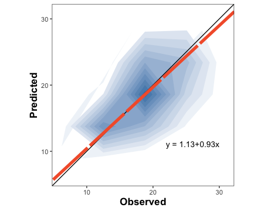

<!-- README.md is generated from README.Rmd. Please edit that file -->

# metrica: Prediction performance metrics.

<!-- badges: start -->

[](https://CRAN.R-project.org/package=metrica)
[](https://r-pkg.org/pkg/metrica)
[](https://r-pkg.org/pkg/metrica)
<br/>

[](https://ci.appveyor.com/project/adriancorrendo/metrica)
[](https://github.com/adriancorrendo/metrica/actions)
[](https://app.codecov.io/gh/adriancorrendo/metrica)
[](https://doi.org/10.5281/zenodo.6543296)

<!-- badges: end -->

## Introduction <br/>


<br/> `metrica` is a compilation of more than 80 functions designed to
quantitatively and visually evaluate the prediction performance of
regression (continuous variables) and classification (categorical
variables) point-forecast models (e.g. APSIM, DSSAT, DNDC, Supervised
Machine Learning). `metrica` offers a toolbox with a wide spectrum of
goodness of fit, error metrics, indices, and coefficients accounting for
different aspects of the agreement between predicted and observed
values, plus some basic visualization functions to assess models
performance (e.g. confusion matrix, scatter with regression line;
Bland-Altman plot) provided in customizable format (ggplot).

For supervised models, always keep in mind the concept of
“cross-validation” since predicted values should ideally come from
out-of-bag samples (unseen by training sets) to avoid overestimation of
the prediction performance. <br/>

Check the Documentation at <https://adriancorrendo.github.io/metrica/>
<br/>

**Vignettes** <br/>

[1. List of metrics for
Regression](https://adriancorrendo.github.io/metrica/articles/available_metrics_regression.html)
<br/>

[2. List of metrics for
Classification](https://adriancorrendo.github.io/metrica/articles/available_metrics_classification.html)
<br/>

[3. A regression case (numerical
variables)](https://adriancorrendo.github.io/metrica/articles/regression_case.html)
<br/>

[4. A classification case (categorical
variables)](https://adriancorrendo.github.io/metrica/articles/classification_case.html)
<br/>

[5. Import files from
APSIM](https://adriancorrendo.github.io/metrica/articles/apsim_open.html)
<br/>

## Functions <br/>

For regression models, it includes 4 plotting functions (scatter, tiles,
density, & Bland-Altman plots), and 48 prediction performance scores
including error metrics (MBE, MAE, RAE, RMAE, MAPE, SMAPE, MSE, RMSE,
RRMSE, RSR, PBE, iqRMSE), error decomposition (MLA, MLP, PLA, PLP, PAB,
PPB, SB, SDSD, LCS, Ub, Uc, Ue), model efficiency (NSE, E1, Erel, KGE),
indices of agreement (d, d1, d1r, RAC, AC, lambda), goodness of fit (r,
R2, RSS, TSS, RSE), adjusted correlation coefficients (CCC, Xa, distance
correlation-dcorr-, maximal information coefficient -MIC-), variability
(uSD, var_u), and symmetric regression coefficients (B0_sma, B1_sma).
Specifically for time-series predictions, `metrica` also includes the
Mean Absolute Scaled Error (MASE). <br/>

For classification (binomial and multinomial) tasks, it includes a
function to visualize the confusion matrix using ggplot2, and 27
functions of prediction scores including: accuracy, error rate,
precision, recall, specificity, balanced accuracy (balacc), F-score
(fscore), adjusted F-score (agf), G-mean (gmean), Bookmaker Informedness
(bmi, a.k.a. Youden’s J-index), Markedness (deltaP), Matthews
Correlation Coefficient (mcc), Cohen’s Kappa (khat), negative predictive
value (npv), positive and negative likelihood ratios (posLr, negLr),
diagnostic odds ratio (dor), prevalence (preval), prevalence threshold
(preval_t), critical success index (csi, a.k.a. threat score), false
positive rate (FPR), false negative rate (FNR), false detection rate
(FDR), false omission rate (FOR), and area under the ROC curve
(AUC_roc). <br/>

`metrica` also offers a function that allows users to run all prediction
performance scores at once. The user just needs to specify the type of
model (“regression” or “classification”). <br/>

For more details visit the vignettes
<https://adriancorrendo.github.io/metrica/>.

## Using the functions <br/>

There are two basic arguments common to all `metrica` functions: (i)
`obs`(Oi; observed, a.k.a. actual, measured, truth, target, label), and
(ii) `pred` (Pi; predicted, a.k.a. simulated, fitted, modeled, estimate)
values. <br/>

Optional arguments include `data` that allows to call an existing data
frame containing both observed and predicted vectors, and `tidy`, which
controls the type of output as a list (tidy = FALSE) or as a data.frame
(tidy = TRUE). <br/>

For regression, some specific functions for regression also require to
define the axis `orientation`. For example, the slope of the symmetric
linear regression describing the bivariate scatter (SMA). <br/>

For binary classification (two classes), functions also require to check
the `pos_level` arg., which indicates the alphanumeric order of the
“positive level”. Normally, the most common binary denominations are
c(0,1), c(“Negative”, “Positive”), c(“FALSE”, “TRUE”), so the default
pos_level = 2 (1, “Positive”, “TRUE”). However, other cases are also
possible, such as c(“Crop”, “NoCrop”) for which the user needs to
specify pos_level = 1. <br/>

For multiclass classification tasks, some functions present the `atom`
arg. (logical TRUE / FALSE), which controls the output to be an overall
average estimate across all classes, or a class-wise estimate. For
example, user might be interested in obtaining estimates of precision
and recall for each possible class of the prediction. <br/>

## 1. Installation

You can install the CRAN version of `metrica` with: <br/>

``` r
install.packages("metrica")
```

You can install the development version from
[GitHub](https://github.com/) with:

``` r
# install.packages("devtools")
devtools::install_github("adriancorrendo/metrica")
```

## 2. Native datasets

The *metrica* package comes with four example datasets of continuous
variables (regression) from the APSIM software: <br/> 1. `wheat`. 137
data-points of wheat grain N (grams per squared meter) <br/> 2.
`barley`. 69 data-points of barley grain number (x1000 grains per
squared meter) <br/> 3. `sorghum`. 36 data-points of sorghum grain
number (x1000 grains per squared meter) <br/> 4. `chickpea`. 39
data-points of chickpea aboveground dry mass (kg per hectare) <br/>

These data correspond to the latest, up-to-date, documentation and
validation of version number 2020.03.27.4956. Data available at:
<https://doi.org/10.7910/DVN/EJS4M0>. Further details can be found at
the official APSIM Next Generation website:
<https://APSIMnextgeneration.netlify.app/modeldocumentation> <br/>

## 3. Example Code

### Libraries

``` r
library(metrica)
library(dplyr)
library(purrr)
library(ggplot2)
library(tidyr)
```

This is a basic example which shows you the core regression and
classification functions of *metrica*: <br/>

## 3.1. REGRESSION

``` r
# 1. A. Create a random dataset
# Set seed for reproducibility
set.seed(1)
# Create a random vector (X) with 100 values
X <- rnorm(n = 100, mean = 0, sd = 10)
# Create a second vector (Y) with 100 values by adding error with respect
# to the first vector (X).
Y <- X + rnorm(n=100, mean = 0, sd = 3)
# Merge vectors in a data frame, rename them as synonyms of observed (measured) and predicted (simulated)
example.data <- data.frame(measured = X, simulated = Y)

# 1. B. Or call native example datasets

example.data <- barley %>%  # or 'wheat', 'sorghum', or 'chickpea'
# 1.b. create columns as synonyms of observed (measured) and predicted (simulated)
                mutate(measured = obs, simulated = pred)  
```

### 3.1.1. Plot functions

### 3.1.1.1. Create a customizable scatter plot with PO orientation

``` r
barley.scat.plot <- 
  metrica::scatter_plot(data = example.data, 
                        obs = measured, 
                        pred = simulated,
                        orientation = "PO", 
                        print_eq = TRUE,
                        position_eq = c(x=24, y =8), 
                        # Optional arguments to customize the plot
                        shape_type = 21,
                        shape_color = "steelblue",
                        shape_size = 3,
                        regline_type = "F1",
                        regline_color = "#9e0059",
                        regline_size = 2)+
  # Customize axis breaks
  scale_y_continuous(breaks = seq(0,30, by = 5))+
  scale_x_continuous(breaks = seq(0,30, by = 5))

barley.scat.plot
```


``` r
# Alternative using vectors instead of dataframe
#metrica::scatter_plot(obs = example.data$obs, pred = example.data$pred)
```

### 3.1.1.2. Create tiles plot with OP orientation

``` r
barley.tiles.plot <- 
  tiles_plot(data = example.data, 
                      obs = measured, 
                      pred = simulated,
                      bins = 10, 
                      orientation = "OP",
                      colors = c(low = "pink", high = "steelblue"))

barley.tiles.plot
```


### 3.1.1.3. Create a density plot with OP orientation

``` r
barley.density.plot <-
metrica::density_plot(data = example.data, 
                      obs = measured, pred = simulated,
                      n = 5, 
                      orientation = "OP", 
           colors = c(low = "white", high = "steelblue") )+
  theme(legend.position = "none")

barley.density.plot
```



### 3.1.1.4. Create a Bland-Altman plot

``` r
barley.ba.plot <- metrica::bland_altman_plot(data = example.data,
                                             obs = measured, pred = simulated)

barley.ba.plot
```


### 3.1.2. Metrics functions

### 3.1.2.2. Single estimates

``` r
# a. Estimate coefficient of determination (R2)

metrica::R2(data = example.data, obs = measured, pred = simulated)
#> $R2
#> [1] 0.4512998

# b. Estimate root mean squared error (RMSE)
metrica::RMSE(data = example.data, obs = measured, pred = simulated)
#> $RMSE
#> [1] 3.986028

# c. Estimate mean bias error (MBE)
metrica::MBE(data = example.data, obs = measured, pred = simulated)
#> $MBE
#> [1] 0.207378

# c. Estimate index of agreement (d)
metrica::d(data = example.data, obs = measured, pred = simulated)
#> $d
#> [1] 0.8191397

# e. Estimate SMA regression intercept (B0)
metrica::B0_sma(data = example.data, obs = measured, pred = simulated, tidy = TRUE)
#>         B0
#> 1 1.128274

# f. Estimate SMA regression slope (B1)
metrica::B1_sma(data = example.data, obs = measured, pred = simulated)
#> $B1
#> [1] 0.9288715
```

### 3.1.2.2. Metrics Summary

``` r
metrics.sum <- metrics_summary(data = example.data, 
                               obs = measured, pred = simulated,
                               type = "regression")  
# Print first 15
head(metrics.sum, n = 15)
#>    Metric      Score
#> 1      B0  1.1282743
#> 2      B1  0.9288715
#> 3       r  0.6717885
#> 4      R2  0.4512998
#> 5      Xa  0.9963915
#> 6     CCC  0.6693644
#> 7     MAE  3.0595501
#> 8    RMAE  0.1629325
#> 9    MAPE 16.8112673
#> 10  SMAPE 16.7848032
#> 11    RAE  0.7639151
#> 12    RSE  0.6164605
#> 13    MBE  0.2073780
#> 14    PBE  1.1043657
#> 15    PAB  0.2706729

# Optional wrangling (WIDE)
metrics.sum.wide <- metrics.sum %>%
  tidyr::pivot_wider(tidyr::everything(),
                      names_from = "Metric",
                      values_from = "Score")

metrics.sum.wide
#> # A tibble: 1 × 45
#>      B0    B1     r    R2    Xa   CCC   MAE  RMAE  MAPE SMAPE   RAE   RSE   MBE
#>   <dbl> <dbl> <dbl> <dbl> <dbl> <dbl> <dbl> <dbl> <dbl> <dbl> <dbl> <dbl> <dbl>
#> 1  1.13 0.929 0.672 0.451 0.996 0.669  3.06 0.163  16.8  16.8 0.764 0.616 0.207
#> # … with 32 more variables: PBE <dbl>, PAB <dbl>, PPB <dbl>, MSE <dbl>,
#> #   RMSE <dbl>, RRMSE <dbl>, RSR <dbl>, iqRMSE <dbl>, MLA <dbl>, MLP <dbl>,
#> #   RMLA <dbl>, RMLP <dbl>, SB <dbl>, SDSD <dbl>, LCS <dbl>, PLA <dbl>,
#> #   PLP <dbl>, Ue <dbl>, Uc <dbl>, Ub <dbl>, NSE <dbl>, E1 <dbl>, Erel <dbl>,
#> #   KGE <dbl>, d <dbl>, d1 <dbl>, d1r <dbl>, RAC <dbl>, AC <dbl>, lambda <dbl>,
#> #   dcorr <dbl>, MIC <dbl>
```

### 3.1.3. Run multiple datasets at once

### 3.1.3.1. Nested data

``` r
# a. Create nested df with the native examples
nested.examples <- bind_rows(list(wheat = metrica::wheat, 
                                  barley = metrica::barley,
                                  sorghum = metrica::sorghum, 
                                  chickpea = metrica::chickpea), 
                             .id = "id") %>%
  dplyr::group_by(id) %>% tidyr::nest() %>% dplyr::ungroup()

head(nested.examples %>% group_by(id) %>% dplyr::slice_head(n=2))
#> # A tibble: 4 × 2
#> # Groups:   id [4]
#>   id       data              
#>   <chr>    <list>            
#> 1 barley   <tibble [69 × 2]> 
#> 2 chickpea <tibble [39 × 2]> 
#> 3 sorghum  <tibble [36 × 2]> 
#> 4 wheat    <tibble [137 × 2]>

# b. Run 
multiple.sum <- nested.examples %>% 
  # Store metrics in new.column "performance"
  mutate(performance = map(data, ~metrica::metrics_summary(data=., obs = obs, pred = pred, 
                                                           type = "regression")))

head(multiple.sum)
#> # A tibble: 4 × 3
#>   id       data               performance  
#>   <chr>    <list>             <list>       
#> 1 wheat    <tibble [137 × 2]> <df [45 × 2]>
#> 2 barley   <tibble [69 × 2]>  <df [45 × 2]>
#> 3 sorghum  <tibble [36 × 2]>  <df [45 × 2]>
#> 4 chickpea <tibble [39 × 2]>  <df [45 × 2]>
```

### 3.1.3.2. Non-nested data <br/>

``` r
non_nested_summary <- nested.examples %>% unnest(cols = "data") %>% 
  group_by(id) %>% 
  summarise(metrics_summary(obs = obs, pred = pred, type = "regression")) %>% 
  dplyr::arrange(Metric)

head(non_nested_summary)
#> # A tibble: 6 × 3
#> # Groups:   id [4]
#>   id       Metric    Score
#>   <chr>    <chr>     <dbl>
#> 1 barley   AC       0.253 
#> 2 chickpea AC       0.434 
#> 3 sorghum  AC       0.0889
#> 4 wheat    AC       0.842 
#> 5 barley   B0       1.13  
#> 6 chickpea B0     -99.0
```

### 3.1.4. Print metrics in a plot

``` r
df <- metrica::wheat

# Create list of selected metrics
selected.metrics <- c("MAE","RMSE", "RRMSE", "R2", "NSE", "KGE", "PLA", "PLP")

# Create the plot
plot <- metrica::scatter_plot(data = df, 
                              obs = obs, pred = pred,
                              # Activate print_metrics arg.
                              print_metrics = TRUE, 
                              # Indicate metrics list
                              metrics_list = selected.metrics,
                              # Customize metrics position
                              position_metrics = c(x = 1 , y = 20),
                              # Customize equation position
                              position_eq = c(x = 7, y = 19.5))

plot
```


## 3.1. CLASSIFICATION <br/>

### Example datasets

``` r
binomial_case <- data.frame(labels = sample(c("Pos","Neg"), 100, replace = TRUE),
                            predictions = sample(c("Pos","Neg"), 100, replace = TRUE)) %>% 
  mutate(predictions = as.factor(predictions), labels = as.factor(labels))

multinomial_case <- data.frame(labels = sample(c("Red","Green", "Blue"), 100, replace = TRUE),
                               predictions = sample(c("Red","Green", "Blue"), 100, replace = TRUE) ) %>% 
  mutate(predictions = as.factor(predictions), labels = as.factor(labels))
```

### 3.1.1. Confusion Matrix <br/>

### 3.1.1.1. Binary

``` r
# a. Print
binomial_case %>% confusion_matrix(obs = labels, pred = predictions, 
                                            plot = FALSE, colors = c(low="#f9dbbd" , high="#735d78"), 
                                            unit = "count")
#>          OBSERVED
#> PREDICTED Neg Pos
#>       Neg  24  24
#>       Pos  21  31

# b. Plot
binomial_case %>% confusion_matrix(obs = labels, pred = predictions, 
                                            plot = TRUE, colors = c(low="#f9dbbd" , high="#735d78"), 
                                            unit = "count", print_metrics = TRUE)
```


### 3.1.1.2. Multiclass

``` r
# a. Print
multinomial_case %>% confusion_matrix(obs = labels, 
                                      pred = predictions, 
                                      plot = FALSE, colors = c(low="#f9dbbd" , high="#735d78"),
                                      unit = "count")
#>          OBSERVED
#> PREDICTED Blue Green Red
#>     Blue     9    11   9
#>     Green   11    12  11
#>     Red     13    13  11

# b. Plot
multinomial_case %>% confusion_matrix(obs = labels, 
                                      pred = predictions, 
                                      plot = TRUE, colors = c(low="#d3dbbd" , high="#885f78"), 
                                      unit = "count", print_metrics = TRUE)
```


### 3.1.1. Classification Metrics <br/>

### 3.1.1.1. Single dataset <br/>

``` r
# Get classification metrics one by one
binomial_case %>% accuracy(data = ., obs = labels, pred = predictions, tidy=TRUE)
#>   accuracy
#> 1     0.55
binomial_case %>% error_rate(data = ., obs = labels, pred = predictions, tidy=TRUE)
#>   error_rate
#> 1       0.45
binomial_case %>% precision(data = ., obs = labels, pred = predictions, tidy=TRUE)
#>   precision
#> 1 0.5961538
binomial_case %>% recall(data = ., obs = labels, pred = predictions, atom = F, tidy=TRUE)
#>      recall
#> 1 0.5636364
binomial_case %>% specificity(data = ., obs = labels, pred = predictions, tidy=TRUE)
#>        spec
#> 1 0.5333333
binomial_case %>% balacc(data = ., obs = labels, pred = predictions, tidy=TRUE)
#>      balacc
#> 1 0.5484848
binomial_case %>% fscore(data = ., obs = labels, pred = predictions, tidy=TRUE)
#>      fscore
#> 1 0.5794393
binomial_case %>% agf(data = ., obs = labels, pred = predictions, tidy=TRUE)
#>         agf
#> 1 0.5795213
binomial_case %>% gmean(data = ., obs = labels, pred = predictions, tidy=TRUE)
#>       gmean
#> 1 0.5482755
binomial_case %>% khat(data = ., obs = labels, pred = predictions, tidy=TRUE)
#>         khat
#> 1 0.09638554
binomial_case %>% mcc(data = ., obs = labels, pred = predictions, tidy=TRUE)
#>          mcc
#> 1 0.09656091
binomial_case %>% fmi(data = ., obs = labels, pred = predictions, tidy=TRUE)
#>         fmi
#> 1 0.5796671
binomial_case %>% posLr(data = ., obs = labels, pred = predictions, tidy=TRUE)
#>      posLr
#> 1 1.207792
binomial_case %>% negLr(data = ., obs = labels, pred = predictions, tidy=TRUE)
#>       negLr
#> 1 0.8181818
binomial_case %>% dor(data = ., obs = labels, pred = predictions, tidy=TRUE)
#>       dor
#> 1 1.47619

# Get all at once with metrics_summary()
binomial_case %>% metrics_summary(data = ., obs = labels, pred = predictions, type = "classification")
#>         Metric      Score
#> 1     accuracy 0.55000000
#> 2   error_rate 0.45000000
#> 3    precision 0.59615385
#> 4       recall 0.56363636
#> 5  specificity 0.53333333
#> 6       balacc 0.54848485
#> 7       fscore 0.57943925
#> 8          agf 0.57952126
#> 9        gmean 0.54827553
#> 10        khat 0.09638554
#> 11         mcc 0.09656091
#> 12         fmi 0.57966713
#> 13         bmi 0.09696970
#> 14         csi 0.40789474
#> 15      deltap 0.09615385
#> 16       posLr 1.20779221
#> 17       negLr 0.81818182
#> 18         dor 1.47619048
#> 19         npv 0.50000000
#> 20         FPR 0.46666667
#> 21         FNR 0.43636364
#> 22         FDR 0.40384615
#> 23         FOR 0.50000000
#> 24      preval 0.55000000
#> 25    preval_t 0.49309260
#> 26     AUC_roc 0.54848485

# Multinomial
multinomial_case %>% metrics_summary(data = ., obs = labels, pred = predictions, type = "classification")
#> Warning in metrica::fscore(data = ~., obs = ~labels, pred = ~predictions, :
#> For multiclass cases, the fscore should be estimated at a class level. Please,
#> consider using `atom = TRUE`
#> Warning in metrica::agf(data = ~., obs = ~labels, pred = ~predictions, pos_level
#> = pos_level): For multiclass cases, the agf should be estimated at a class
#> level. Please, consider using `atom = TRUE`
#> Warning in metrica::fmi(data = ~., obs = ~labels, pred = ~predictions, pos_level
#> = pos_level): The Fowlkes-Mallows Index is not available for multiclass cases.
#> The result has been recorded as NaN.
#> Warning in metrica::preval(data = ~., obs = ~labels, pred = ~predictions, : For
#> multiclass cases, prevalence should be estimated at a class level. A NaN has
#> been recorded as the result. Please, use `atom = TRUE`
#> Warning in metrica::preval_t(data = ~., obs = ~labels, pred = ~predictions, : For multiclass cases, prevalence threshold should be estimated at a class level. 
#>       A NaN has been recorded as the result. Please, use `atom = TRUE`.
#>         Metric       Score
#> 1     accuracy  0.32000000
#> 2   error_rate  0.68000000
#> 3    precision  0.32019443
#> 4       recall  0.32029977
#> 5  specificity  0.66031031
#> 6       balacc  0.49030504
#> 7       fscore  0.32024709
#> 8          agf  0.32024710
#> 9        gmean  0.45988829
#> 10        khat -0.01918465
#> 11         mcc -0.01926552
#> 12         fmi         NaN
#> 13         bmi -0.01938991
#> 14         csi  0.13793860
#> 15      deltap -0.01951385
#> 16       posLr  0.94291874
#> 17       negLr  1.02936485
#> 18         dor  0.91601996
#> 19         npv  0.66029172
#> 20         FPR  0.33968969
#> 21         FNR  0.67970023
#> 22         FDR  0.67980557
#> 23         FOR  0.33970828
#> 24      preval         NaN
#> 25    preval_t         NaN
#> 26     AUC_roc  0.49030504

# Get a selected list at once with metrics_summary()
selected_class_metrics <- c("accuracy", "recall", "fscore")

# Binary
binomial_case %>% metrics_summary(data = ., obs = labels, pred = predictions, type = "classification",
                                  metrics_list = selected_class_metrics)
#>     Metric     Score
#> 1 accuracy 0.5500000
#> 2   recall 0.5636364
#> 3   fscore 0.5794393

# Multiclass
multinomial_case %>% metrics_summary(data = ., obs = labels, pred = predictions, type = "classification",
                                  metrics_list = selected_class_metrics)
#> Warning in metrica::fscore(data = ~., obs = ~labels, pred = ~predictions, :
#> For multiclass cases, the fscore should be estimated at a class level. Please,
#> consider using `atom = TRUE`
#> Warning in metrica::agf(data = ~., obs = ~labels, pred = ~predictions, pos_level
#> = pos_level): For multiclass cases, the agf should be estimated at a class
#> level. Please, consider using `atom = TRUE`
#> Warning in metrica::fmi(data = ~., obs = ~labels, pred = ~predictions, pos_level
#> = pos_level): The Fowlkes-Mallows Index is not available for multiclass cases.
#> The result has been recorded as NaN.
#> Warning in metrica::preval(data = ~., obs = ~labels, pred = ~predictions, : For
#> multiclass cases, prevalence should be estimated at a class level. A NaN has
#> been recorded as the result. Please, use `atom = TRUE`
#> Warning in metrica::preval_t(data = ~., obs = ~labels, pred = ~predictions, : For multiclass cases, prevalence threshold should be estimated at a class level. 
#>       A NaN has been recorded as the result. Please, use `atom = TRUE`.
#>     Metric     Score
#> 1 accuracy 0.3200000
#> 2   recall 0.3202998
#> 3   fscore 0.3202471
```

``` r
multinomial_case %>% accuracy(data = ., obs = labels, pred = predictions, tidy=TRUE)
#>   accuracy
#> 1     0.32
multinomial_case %>% error_rate(data = ., obs = labels, pred = predictions, tidy=TRUE)
#>   error_rate
#> 1       0.68
multinomial_case %>% precision(data = ., obs = labels, pred = predictions, tidy=TRUE)
#>   precision
#> 1 0.3201944
multinomial_case %>% recall(data = ., obs = labels, pred = predictions, atom = F, tidy=TRUE)
#>      recall
#> 1 0.3202998
multinomial_case %>% specificity(data = ., obs = labels, pred = predictions, tidy=TRUE)
#>        spec
#> 1 0.6603103
multinomial_case %>% balacc(data = ., obs = labels, pred = predictions, tidy=TRUE)
#>     balacc
#> 1 0.490305
multinomial_case %>% fscore(data = ., obs = labels, pred = predictions, tidy=TRUE)
#> Warning in fscore(data = ., obs = labels, pred = predictions, tidy = TRUE):
#> For multiclass cases, the fscore should be estimated at a class level. Please,
#> consider using `atom = TRUE`
#>      fscore
#> 1 0.3202471
multinomial_case %>% agf(data = ., obs = labels, pred = predictions, tidy=TRUE)
#> Warning in agf(data = ., obs = labels, pred = predictions, tidy = TRUE): For
#> multiclass cases, the agf should be estimated at a class level. Please, consider
#> using `atom = TRUE`
#>         agf
#> 1 0.3202471
multinomial_case %>% gmean(data = ., obs = labels, pred = predictions, tidy=TRUE)
#>       gmean
#> 1 0.4598883
multinomial_case %>% khat(data = ., obs = labels, pred = predictions, tidy=TRUE)
#>          khat
#> 1 -0.01918465
multinomial_case %>% mcc(data = ., obs = labels, pred = predictions, tidy=TRUE)
#>           mcc
#> 1 -0.01926552
multinomial_case %>% fmi(data = ., obs = labels, pred = predictions, tidy=TRUE)
#> Warning in fmi(data = ., obs = labels, pred = predictions, tidy = TRUE): The
#> Fowlkes-Mallows Index is not available for multiclass cases. The result has been
#> recorded as NaN.
#>   fmi
#> 1 NaN
multinomial_case %>% posLr(data = ., obs = labels, pred = predictions, tidy=TRUE)
#>       posLr
#> 1 0.9429187
multinomial_case %>% negLr(data = ., obs = labels, pred = predictions, tidy=TRUE)
#>      negLr
#> 1 1.029365
multinomial_case %>% dor(data = ., obs = labels, pred = predictions, tidy=TRUE)
#>       dor
#> 1 0.91602
multinomial_case %>% deltap(data = ., obs = labels, pred = predictions, tidy=TRUE)
#>        deltap
#> 1 -0.01951385
multinomial_case %>% csi(data = ., obs = labels, pred = predictions, tidy=TRUE)
#>         csi
#> 1 0.1379386
multinomial_case %>% FPR(data = ., obs = labels, pred = predictions, tidy=TRUE)
#>         FPR
#> 1 0.3396897
multinomial_case %>% FNR(data = ., obs = labels, pred = predictions, tidy=TRUE)
#>         FNR
#> 1 0.6797002
multinomial_case %>% FDR(data = ., obs = labels, pred = predictions, tidy=TRUE)
#>         FDR
#> 1 0.6798056
multinomial_case %>% FOR(data = ., obs = labels, pred = predictions, tidy=TRUE)
#>         FOR
#> 1 0.3397083
multinomial_case %>% preval(data = ., obs = labels, pred = predictions, tidy=TRUE)
#> Warning in preval(data = ., obs = labels, pred = predictions, tidy = TRUE): For
#> multiclass cases, prevalence should be estimated at a class level. A NaN has
#> been recorded as the result. Please, use `atom = TRUE`
#>   prev
#> 1  NaN
multinomial_case %>% preval_t(data = ., obs = labels, pred = predictions, tidy=TRUE)
#> Warning in preval_t(data = ., obs = labels, pred = predictions, tidy = TRUE): For multiclass cases, prevalence threshold should be estimated at a class level. 
#>       A NaN has been recorded as the result. Please, use `atom = TRUE`.
#>   preval_t
#> 1      NaN
multinomial_case %>% AUC_roc(data = ., obs = labels, pred = predictions, tidy=TRUE)
#>    AUC_roc
#> 1 0.490305
```

## 4. Import data from APSIM

Please, visit the
[vignette](https://adriancorrendo.github.io/metrica/articles/apsim_open.html)
