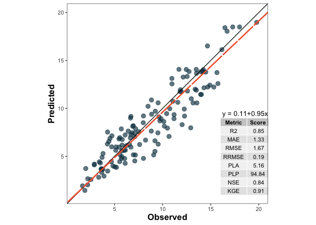

<!-- README.md is generated from README.Rmd. Please edit that file -->

# metrica: Prediction performance metrics.

<!-- badges: start -->

[](https://CRAN.R-project.org/package=metrica)
[](https://r-pkg.org/pkg/metrica)
[](https://r-pkg.org/pkg/metrica)
<br/>

[](https://ci.appveyor.com/project/adriancorrendo/metrica)
[](https://github.com/adriancorrendo/metrica/actions)
[](https://app.codecov.io/gh/adriancorrendo/metrica)
[](https://doi.org/10.5281/zenodo.6543296)

<!-- badges: end -->

A compilation of more than 50 functions designed to evaluate prediction
performance of regression (continuous variables) and classification
(categorical variables) point-forecast models. Offered scoring rules
account for different aspects of the agreement between predicted and
observed values. For regression, it includes error metrics (e.g. MAE,
RMSE), model efficiencies (e.g. NSE, KGE), indices of agreement (e.g. d,
RAC), goodness of fit (e.g. r, R2), concordance correlation (e.g. CCC),
error decomposition (e.g. lack of accuracy-precision), and plots the
visualize agreement. For classification (binomial and multinomial), it
includes functions for confusion matrix, accuracy, precision, recall,
specificity, F-score, and Cohen’s Kappa. For more details visit the
vignettes <https://adriancorrendo.github.io/metrica/>.

The goal of the *metrica* package is to offer users of regression
(continuous variables) and classification (categorical variables)
point-forecast simulation models (e.g. APSIM, DSSAT, DNDC, Machine
Learning) a toolbox with a wide spectrum of goodness of fit, error
metrics, indices, and coefficients accounting for different aspects of
the agreement between predicted and observed values. Also, *metrica*
some basic visualization functions to assess models performance
(e.g. confusion matrix, scatter with regression line; Bland-Altman plot)
provided in customizable format (ggplot).


<br/>

This package contains +50 functions. Two arguments are always required:
`observed`(Oi; a.k.a. actual, measured, truth, target) and `predicted`
(Pi; a.k.a. simulated, fitted) values. Optional arguments include `data`
that allows to call an existing data frame containing both observed and
predicted vectors, and `tidy`, which controls the type of output as a
list (tidy = FALSE) or as a data.frame (tidy = TRUE). <br/>

Some functions for regression also require to define the axis
`orientation`. For example, the slope of the symmetric linear regression
describing the bivariate scatter (SMA). Current included functions cover
both worlds: “regression” (i.e. continuous variables) & classification
(i.e. nominal or categorical variables). <br/>

Always keep in mind that predicted values should come from out-of-bag
samples (unseen by training set) to avoid overestimation of prediction
performance. <br/>

Check the Documentation at <https://adriancorrendo.github.io/metrica/>
<br/>

**Vignettes** <br/>

[1. Complete list of
metrics](https://adriancorrendo.github.io/metrica/articles/available_metrics.html)
<br/>

[2. A regression
case](https://adriancorrendo.github.io/metrica/articles/vignette1.html)
<br/>

[3. A classification
case](https://adriancorrendo.github.io/metrica/articles/vignette1.html)
<br/>

## 1. Installation

You can install the CRAN version of `metrica` with: <br/>

``` r
install.packages("metrica")
```

You can install the development version from
[GitHub](https://github.com/) with:

``` r
# install.packages("devtools")
devtools::install_github("adriancorrendo/metrica")
```

## 2. Native datasets

The *metrica* package comes with four example datasets of continuous
variables (regression) from the APSIM software: <br/> 1. `wheat`. 137
data-points of wheat grain N (grams per squared meter) <br/> 2.
`barley`. 69 data-points of barley grain number (x1000 grains per
squared meter) <br/> 3. `sorghum`. 36 data-points of sorghum grain
number (x1000 grains per squared meter) <br/> 4. `chickpea`. 39
data-points of chickpea aboveground dry mass (kg per hectare) <br/>

These data correspond to the latest, up-to-date, documentation and
validation of version number 2020.03.27.4956. Data available at:
<https://doi.org/10.7910/DVN/EJS4M0>. Further details can be found at
the official APSIM Next Generation website:
<https://APSIMnextgeneration.netlify.app/modeldocumentation> <br/>

## 3. Example Code

### Libraries

``` r
library(metrica)
library(dplyr)
library(purrr)
library(tidyr)
library(ggpmisc)
```

This is a basic example which shows you the core regression and
classification functions of *metrica*: <br/>

## 3.1. REGRESSION

``` r
# 1. A. Create a random dataset
# Set seed for reproducibility
set.seed(1)
# Create a random vector (X) with 100 values
X <- rnorm(n = 100, mean = 0, sd = 10)
# Create a second vector (Y) with 100 values by adding error with respect
# to the first vector (X).
Y <- X + rnorm(n=100, mean = 0, sd = 3)
# Merge vectors in a data frame, rename them as synonyms of observed (measured) and predicted (simulated)
example.data <- data.frame(measured = X, simulated = Y)

# 1. B. Or call native example datasets

example.data <- barley %>%  # or 'wheat', 'sorghum', or 'chickpea'
# 1.b. create columns as synonyms of observed (measured) and predicted (simulated)
                mutate(measured = obs, simulated = pred)  
```

### 3.1.1. Plot functions

### 3.1.1.1. Create scatter plot with PO orientation

``` r
barley.scat.plot <- metrica::scatter_plot(data = example.data, 
                                          obs = measured, 
                                          pred = simulated,
                                          orientation = "PO")
barley.scat.plot
```


``` r
# Alternative using vectors instead of dataframe
#metrica::scatter_plot(obs = example.data$obs, pred = example.data$pred)
```

### 3.1.1.2. Create tiles plot with OP orientation

``` r
barley.tiles.plot <- 
  metrica::tiles_plot(data = example.data, 
                      obs = measured, 
                      pred = simulated,
                      bins = 10, 
                      orientation = "OP",
                      colors = c(low = "pink", high = "steelblue"))

barley.tiles.plot
```


### 3.1.1.3. Create a density plot with OP orientation

``` r
barley.density.plot <-
metrica::density_plot(data = example.data, 
                      obs = measured, pred = simulated,
                      n = 5, 
                      orientation = "OP", 
           colors = c(low = "white", high = "steelblue")
           )

barley.density.plot
```


### 3.1.1.4. Create a Bland-Altman plot

``` r
barley.ba.plot <- metrica::bland_altman_plot(data = example.data,
                           obs = measured, pred = simulated)

barley.ba.plot
```


### 3.1.2. Metrics functions

### 3.1.2.2. Single estimates

``` r
# a. Estimate coefficient of determination (R2)

metrica::R2(data = example.data, obs = measured, pred = simulated)
#> [1] 0.4512998

# b. Estimate root mean squared error (RMSE)
metrica::RMSE(data = example.data, obs = measured, pred = simulated)
#> [1] 3.986028

# c. Estimate mean bias error (MBE)
metrica::MBE(data = example.data, obs = measured, pred = simulated)
#> [1] 0.207378

# c. Estimate index of agreement (d)
metrica::d(data = example.data, obs = measured, pred = simulated)
#> [1] 0.8191397
```

### 3.1.2.2. Metrics Summary

``` r
metrics.sum <- metrica::metrics_summary(data = example.data, 
                                        obs = measured, pred = simulated,
                                        type = "regression")  
# Print first 15
head(metrics.sum, n = 15)
#>    Metric      Score
#> 1      B0  1.1282743
#> 2      B1  0.9288715
#> 3       r  0.6717885
#> 4      R2  0.4512998
#> 5      Xa  0.9963915
#> 6     CCC  0.6693644
#> 7     MAE  3.0595501
#> 8    RMAE  0.1629325
#> 9    MAPE 16.8112673
#> 10  SMAPE 16.7848032
#> 11    RAE  0.7639151
#> 12    RSE  0.6164605
#> 13    MBE  0.2073780
#> 14    PBE  1.1043657
#> 15    PAB  0.2706729

# Optional wrangling (WIDE)
metrics.sum.wide <- metrics.sum %>%
  tidyr::pivot_wider(tidyr::everything(),
                      names_from = "Metric",
                      values_from = "Score")
```

### 3.1.3. Run multiple datasets at once

### 3.1.3.1. Nested data

``` r
# a. Create nested df with the native examples
nested.examples <- bind_rows(list(wheat = metrica::wheat, 
                                  barley = metrica::barley,
                                  sorghum = metrica::sorghum, 
                                  chickpea = metrica::chickpea), 
                             .id = "id") %>%
  dplyr::group_by(id) %>% tidyr::nest() %>% dplyr::ungroup()

head(nested.examples %>% group_by(id) %>% dplyr::slice_head(n=2))
#> # A tibble: 4 × 2
#> # Groups:   id [4]
#>   id       data              
#>   <chr>    <list>            
#> 1 barley   <tibble [69 × 2]> 
#> 2 chickpea <tibble [39 × 2]> 
#> 3 sorghum  <tibble [36 × 2]> 
#> 4 wheat    <tibble [137 × 2]>

# b. Run 
multiple.sum <- nested.examples %>% 
  # Store metrics in new.column "performance"
  mutate(performance = map(data, ~metrica::metrics_summary(data=., obs = obs, pred = pred, 
                                                           type = "regression")))

head(multiple.sum)
#> # A tibble: 4 × 3
#>   id       data               performance  
#>   <chr>    <list>             <list>       
#> 1 wheat    <tibble [137 × 2]> <df [43 × 2]>
#> 2 barley   <tibble [69 × 2]>  <df [43 × 2]>
#> 3 sorghum  <tibble [36 × 2]>  <df [43 × 2]>
#> 4 chickpea <tibble [39 × 2]>  <df [43 × 2]>

View(multiple.sum)
```

### 3.1.3.2. Non-nested data <br/>

``` r
non_nested_summary <- nested.examples %>% unnest(cols = "data") %>% 
  group_by(id) %>% 
  summarise(metrics_summary(obs = obs, pred = pred, type = "regression")) %>% 
  dplyr::arrange(Metric)

head(non_nested_summary)
#> # A tibble: 6 × 3
#> # Groups:   id [4]
#>   id       Metric    Score
#>   <chr>    <chr>     <dbl>
#> 1 barley   AC       0.253 
#> 2 chickpea AC       0.434 
#> 3 sorghum  AC       0.0889
#> 4 wheat    AC       0.842 
#> 5 barley   B0       1.13  
#> 6 chickpea B0     -99.0
```

### 3.1.4. Print metrics in a plot

``` r
df <- metrica::wheat

# Create list of selected metrics
selected.metrics <- c("MAE","RMSE", "RRMSE", "R2", "NSE", "KGE", "PLA", "PLP")

# Create the plot
plot <- metrica::scatter_plot(data = df, 
                              obs = obs, pred = pred,
                              # Activate print_metrics arg.
                              print_metrics = TRUE, 
                              # Indicate metrics list
                              metrics_list = selected.metrics,
                              # Customize metrics position
                              position_metrics = c(x = 1 , y = 20),
                              # Customize equation position
                              position_eq = c(x = 7, y = 19.5))

plot
```



## 3.1. CLASSIFICATION <br/>

### Example datasets

``` r
binomial_case <- data.frame(labels = sample(c("Pos","Neg"), 100, replace = TRUE),
                            predictions = sample(c("Pos","Neg"), 100, replace = TRUE)) %>% 
  mutate(predictions = as.factor(predictions), labels = as.factor(labels))

multinomial_case <- data.frame(labels = sample(c("Red","Green", "Blue"), 100, replace = TRUE),
                               predictions = sample(c("Red","Green", "Blue"), 100, replace = TRUE) ) %>% 
  mutate(predictions = as.factor(predictions), labels = as.factor(labels))
```

### 3.1.1. Confusion Matrix <br/>

### 3.1.1.1. Binary

``` r
# a. Print
binomial_case %>% confusion_matrix(obs = labels, pred = predictions, 
                                            plot = FALSE, colors = c(low="#f9dbbd" , high="#735d78"), 
                                            unit = "count")
#>          OBSERVED
#> PREDICTED Neg Pos
#>       Neg  24  24
#>       Pos  21  31

# b. Plot
binomial_case %>% confusion_matrix(obs = labels, pred = predictions, 
                                            plot = TRUE, colors = c(low="#f9dbbd" , high="#735d78"), 
                                            unit = "count")
```


### 3.1.1.2. Multiclass

``` r
# a. Print
multinomial_case %>% confusion_matrix(obs = labels, 
                                      pred = predictions, 
                                      plot = FALSE, colors = c(low="#f9dbbd" , high="#735d78"),
                                      unit = "count")
#>          OBSERVED
#> PREDICTED Blue Green Red
#>     Blue     9    11   9
#>     Green   11    12  11
#>     Red     13    13  11

# b. Plot
multinomial_case %>% confusion_matrix(obs = labels, 
                                      pred = predictions, 
                                      plot = TRUE, colors = c(low="#d3dbbd" , high="#885f78"), 
                                      unit = "count")
```


### 3.1.1. Classification Metrics <br/>

### 3.1.1.1. Single dataset <br/>

``` r
# Get classification metrics one by one
binomial_case %>% accuracy(data = ., obs = labels, pred = predictions, tidy=TRUE)
#>   accuracy
#> 1     0.55
binomial_case %>% error_rate(data = ., obs = labels, pred = predictions, tidy=TRUE)
#>   misclass_rate
#> 1          0.45
binomial_case %>% precision(data = ., obs = labels, pred = predictions, tidy=TRUE)
#>   precision
#> 1 0.5961538
binomial_case %>% recall(data = ., obs = labels, pred = predictions, atom = F, tidy=TRUE)
#>      recall
#> 1 0.5636364
binomial_case %>% specificity(data = ., obs = labels, pred = predictions, tidy=TRUE)
#>        spec
#> 1 0.5333333
binomial_case %>% baccu(data = ., obs = labels, pred = predictions, tidy=TRUE)
#>       baccu
#> 1 0.5484848
binomial_case %>% fscore(data = ., obs = labels, pred = predictions, tidy=TRUE)
#>      fscore
#> 1 0.5794393
binomial_case %>% cohen_kappa(data = ., obs = labels, pred = predictions, tidy=TRUE)
#>        kappa
#> 1 0.09638554
binomial_case %>% mcc(data = ., obs = labels, pred = predictions, tidy=TRUE)
#>          mcc
#> 1 0.09656091
binomial_case %>% fmi(data = ., obs = labels, pred = predictions, tidy=TRUE)
#>         fmi
#> 1 0.5796671

# Get all at once with metrics_summary()
binomial_case %>% metrics_summary(data = ., obs = labels, pred = predictions, type = "classification")
#>         Metric      Score
#> 1     accuracy 0.55000000
#> 2   error_rate 0.45000000
#> 3    precision 0.59615385
#> 4       recall 0.56363636
#> 5  specificity 0.53333333
#> 6        baccu 0.54848485
#> 7       fscore 0.57943925
#> 8  cohen_kappa 0.09638554
#> 9          mcc 0.09656091
#> 10         fmi 0.57966713
multinomial_case %>% metrics_summary(data = ., obs = labels, pred = predictions, type = "classification")
#> Warning in metrica::mcc(data = ~., obs = ~labels, pred = ~predictions): The
#> generalization of the Matthews Correlation Coefficient for a multiclass setting
#> has not been implemented yet in metrica
#> Warning in metrica::fmi(data = ~., obs = ~labels, pred = ~predictions): The
#> Fowlkes-Mallows Index is not available for multiclass cases. The result has been
#> recorded as NA
#>         Metric       Score
#> 1     accuracy  0.32000000
#> 2   error_rate  0.68000000
#> 3    precision  0.32019443
#> 4       recall  0.32029977
#> 5  specificity  0.66031031
#> 6        baccu  0.49030504
#> 7       fscore  0.32024709
#> 8  cohen_kappa -0.01918465
#> 9          mcc          NA
#> 10         fmi          NA

# Get a selected list at once with metrics_summary()
selected_class_metrics <- c("accuracy", "recall", "fscore")

# Binary
binomial_case %>% metrics_summary(data = ., obs = labels, pred = predictions, type = "classification",
                                  metrics_list = selected_class_metrics)
#>     Metric     Score
#> 1 accuracy 0.5500000
#> 2   recall 0.5636364
#> 3   fscore 0.5794393

# Multiclass
multinomial_case %>% metrics_summary(data = ., obs = labels, pred = predictions, type = "classification",
                                  metrics_list = selected_class_metrics)
#> Warning in metrica::mcc(data = ~., obs = ~labels, pred = ~predictions): The
#> generalization of the Matthews Correlation Coefficient for a multiclass setting
#> has not been implemented yet in metrica
#> Warning in metrica::fmi(data = ~., obs = ~labels, pred = ~predictions): The
#> Fowlkes-Mallows Index is not available for multiclass cases. The result has been
#> recorded as NA
#>     Metric     Score
#> 1 accuracy 0.3200000
#> 2   recall 0.3202998
#> 3   fscore 0.3202471
```

## 4. Import data from APSIM

### 4.1. APSIM Classic (.out)

``` r
# Use import_apsim_out for APSIM Classic output
soybean.out <- metrica::import_apsim_out(filepath = "tests/testthat/examples/soybean.out")

head(soybean.out)
#>   Date (dd/mm/yyyy) yield (kg/ha) biomass (kg/ha) grain_protein (%)
#> 1        16/05/2001        1449.8          2915.9            37.115
#> 2        10/05/2002        1092.5          2965.1            37.115
#> 3        23/04/2003        1368.9          3529.6            37.115
#> 4        26/04/2004        2121.6          4710.3            37.115
#> 5        09/05/2005        1950.3          4303.9            37.115
#> 6        20/04/2006        1670.6          3806.6            37.115
#>   GrainN (g/m^2) lai (m^2/m^2) oilGrainN (g/m^2) grain_oil_conc (%)
#> 1           0.00             0                 0                0.4
#> 2           7.10             0                 0                0.4
#> 3           8.90             0                 0                0.4
#> 4          13.79             0                 0                0.4
#> 5          12.68             0                 0                0.4
#> 6          10.86             0                 0                0.4
```

### 4.1. APSIM NextGeneration (.db)

``` r
# Use import_apsim_db for APSIM NextGeneration output
soybean.db <- metrica::import_apsim_db(filename = "soybean.example.db", folder = "tests/testthat/examples/")

head(soybean.db)
#>   CheckpointID SimulationID    Zone         Clock.Today Soybean.Phenology.Stage
#> 1            1            1 paddock 2018-01-01 12:00:00                       1
#> 2            1            1 paddock 2018-01-02 12:00:00                       1
#> 3            1            1 paddock 2018-01-03 12:00:00                       1
#> 4            1            1 paddock 2018-01-04 12:00:00                       1
#> 5            1            1 paddock 2018-01-05 12:00:00                       1
#> 6            1            1 paddock 2018-01-06 12:00:00                       1
#>   Soybean.Phenology.CurrentStageName Soybean.AboveGround.Wt Yield
#> 1                                                         0     0
#> 2                                                         0     0
#> 3                                                         0     0
#> 4                                                         0     0
#> 5                                                         0     0
#> 6                                                         0     0
#>   Soybean.Grain.Size Soybean.Grain.Number Soybean.Total.Wt Soybean.Leaf.FRGR
#> 1                  0                    0                0                 0
#> 2                  0                    0                0                 0
#> 3                  0                    0                0                 0
#> 4                  0                    0                0                 0
#> 5                  0                    0                0                 0
#> 6                  0                    0                0                 0
#>   Soybean.Leaf.Fw Soybean.Leaf.Photosynthesis.FT Soybean.Leaf.Photosynthesis.FW
#> 1               1                              0                              1
#> 2               1                              0                              1
#> 3               1                              0                              1
#> 4               1                              0                              1
#> 5               1                              0                              1
#> 6               1                              0                              1
#>   Soybean.WaterUptake(1) Soybean.WaterUptake(2) Soybean.WaterUptake(3)
#> 1                     NA                     NA                     NA
#> 2                     NA                     NA                     NA
#> 3                     NA                     NA                     NA
#> 4                     NA                     NA                     NA
#> 5                     NA                     NA                     NA
#> 6                     NA                     NA                     NA
#>   Soybean.WaterUptake(4) Soybean.WaterUptake(5) Soybean.WaterUptake(6)
#> 1                     NA                     NA                     NA
#> 2                     NA                     NA                     NA
#> 3                     NA                     NA                     NA
#> 4                     NA                     NA                     NA
#> 5                     NA                     NA                     NA
#> 6                     NA                     NA                     NA
#>   Soybean.WaterUptake(7) Soybean.WaterUptake(8) Soybean.WaterUptake(9)
#> 1                     NA                     NA                     NA
#> 2                     NA                     NA                     NA
#> 3                     NA                     NA                     NA
#> 4                     NA                     NA                     NA
#> 5                     NA                     NA                     NA
#> 6                     NA                     NA                     NA
#>   Soybean.WaterUptake(10)       Date
#> 1                      NA 2018-01-01
#> 2                      NA 2018-01-02
#> 3                      NA 2018-01-03
#> 4                      NA 2018-01-04
#> 5                      NA 2018-01-05
#> 6                      NA 2018-01-06

# If observed.data is already as a dataframe, the user may do the match using a simple code like this:
# PO.dataframe <- simulated.data %>% left_join(., observed.data) *by = "col" arg. could be required*
```
