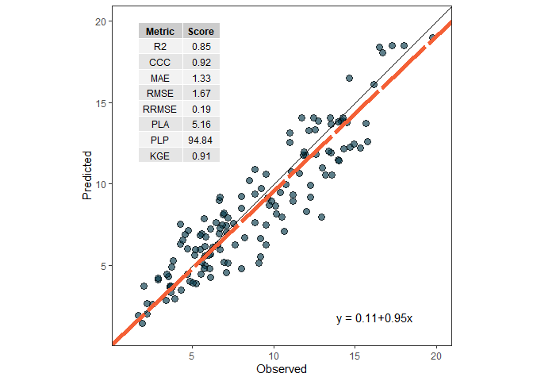
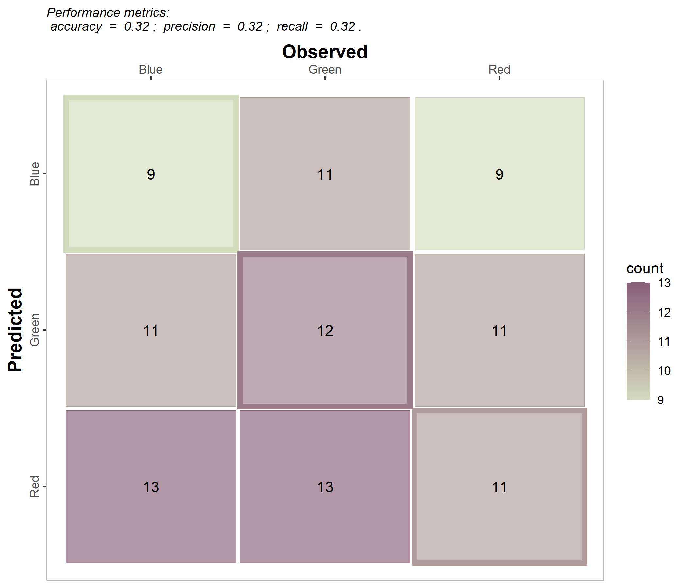

# Summary

The `metrica` R-package [@metrica_manual] is an open-source software designed to facilitate the quantitative and visual assessment of prediction performance of point-forecast simulation models for continuous (regression) and categorical variables (classification). The package assembles a series of more than 80 functions that account for different aspects of the agreement between predicted and observed values. Without the need of advanced skills on programming, `metrica` enables users to automate the estimation of multiple prediction performance metrics including goodness of fit, error metrics, error decomposition, model efficiency, indices of agreement, and to produce stylish data visualization outputs.

# Statement of need

Evaluating the prediction quality is one of the most relevant steps of simulation models (CITATIONS).
Although a myriad of metrics exist to conduct the prediction performance assessment in R, however, they are normally spread across many packages. This scenario creates the need of either to create self-defined functions or to depend on multiple functions from multiple different packages.

To conduct a comprehensive assessment of prediction performance combining different perspectives in R, users have to use multiple packages or even have to define functions by hand. 

APSIM count with integration to R through packages such as apsimx [@apsimx_manual], however, a model evaluation is not yet integrated for APSIM users.
Metrica offers a framework of quantitative and visual assessment of agreement between predicted and observed values.

Nonetheless, the reproducibility of data analysis continues as a challenge for science in general [5-National Academies of Sciences, Engineering, and Medicine 2019; 6-Seibold et al. 2022], 

As an open source software, `metrica` facilitates a transparent and reproducible process to assist researchers on evaluation models performance. 

Undoubtedly, R software plays nowadays a pivotal role in data science. Created in 1992 by statisticians Ross Ihaka and Robert Gentleman, R brings the philosophy of collaboration in science to the distribution of code, democratizing statistical computing, and making it more effective and efficient for everyone [@Thieme_2018]. Its open-source philosophy not only fosters the hosting of state-of-the-art algorithms for advanced statistical analysis but it also conjugates transparency and expeditiousness to fix issues with the codes (bugs). Moreover, R consolidates a global dissemination through the Comprehensive R Archive Network (CRAN), a network of servers that stores up-to-date code versions and documentation about R for multiple operative systems [@Hackenberger_2020].

This article introduces the soiltestcorr R-package, developed with the main objective of contributing to reproducibility in the data analysis of soil fertility trials. 


The use of `metrica` is...

# Usage

### Regression (continuous variables)

For regression models, it includes 4 plotting functions (scatter, tiles, density, & Bland-Altman plots), and 48 prediction performance scores including error metrics (MBE, MAE, RAE, RMAE, MAPE, SMAPE, MSE, RMSE, RRMSE, RSR, PBE, iqRMSE), error decomposition (MLA, MLP, PLA, PLP, PAB, PPB, SB, SDSD, LCS, Ub, Uc, Ue), model efficiency (NSE, E1, Erel, KGE), indices of agreement (d, d1, d1r, RAC, AC, lambda), goodness of fit (r, R2, RSS, TSS, RSE), adjusted correlation coefficients (CCC, Xa, distance correlation-dcorr-, maximal information coefficient -MIC-), variability (uSD, var_u), and symmetric regression coefficients (B0_sma, B1_sma). Specifically for time-series predictions, metrica also includes the Mean Absolute Scaled Error (MASE).

 

### Classification (categorical variables)

For classification (binomial and multinomial) tasks, it includes a function to visualize the confusion matrix using ggplot2, and 27 functions of prediction scores including: accuracy, error rate, precision, recall, specificity, balanced accuracy (balacc), F-score (fscore), adjusted F-score (agf), G-mean (gmean), Bookmaker Informedness (bmi, a.k.a. Youden’s J-index), Markedness (deltaP), Matthews Correlation Coefficient (mcc), Cohen’s Kappa (khat), negative predictive value (npv), positive and negative likelihood ratios (posLr, negLr), diagnostic odds ratio (dor), prevalence (preval), prevalence threshold (preval_t), critical success index (csi, a.k.a. threat score), false positive rate (FPR), false negative rate (FNR), false detection rate (FDR), false omission rate (FOR), and area under the ROC curve (AUC_roc). 

 

### Table 1: Example table.

| Col1 | Col2 | Col3 |
|---|---|---|
| ABC | DEFG | HIJKL |

3.1.	System requirements and installation

Since the metrica package operates within the R environment, the first step is to install R (version 4.2.0 or higher), a free software available at its official website [@R_Core_Team]. To assist on the interface experience with R, we encourage users to install the latest version RStudio desktop [@RStudio_manual] as a free and user-friendly environment that facilitates to operate R.

To install the latest stable version (CRAN mirror) of metrica package, users just need to run to following lines:

```
install.packages("metrica")

```

To install the latest development version (GitHub repository) of soiltestcorr package, users just need to run to following lines:

```
devtools::install_github("adriancorrendo/metrica")

```

To load the package, users simply need to type:

```
library(metrica)

```
By default, all dependencies required by the package will be automatically installed


# APSIM files

To import files from simulation models like APSIM Classic and APSIM Next Gen...

# Dependencies

`metrica` has the following main dependencies

Other packages to compute error metrics: 

- `yardstick` [@yardstick_manual] 
- `Metrics` [@Metrics_manual]
- `hydroGOF` [@hydroGOF_manual]
- `performance` [@performance_paper]

# Formulae

Single dollars ($) are required for inline mathematics e.g. $f(x) = e^{\pi/x}$

Double dollars make self-standing equations:

$$\Theta(x) = \left\{\begin{array}{l}
0\textrm{ if } x < 0\cr
1\textrm{ else}
\end{array}\right.$$

You can also use plain \LaTeX for equations
\begin{equation}\label{eq:fourier}
\hat f(\omega) = \int_{-\infty}^{\infty} f(x) e^{i\omega x} dx
\end{equation}
and refer to \autoref{eq:fourier} from text.

# Citations

Citations to entries in paper.bib should be in
[rMarkdown](http://rmarkdown.rstudio.com/authoring_bibliographies_and_citations.html)
format.

If you want to cite a software repository URL (e.g. something on GitHub without a preferred
citation) then you can do it with the example BibTeX entry below for @fidgit.

For a quick reference, the following citation commands can be used:

- `@author:2001`  ->  "Author et al. (2001)"
- `[@author:2001]` -> "(Author et al., 2001)"
- `[@author1:2001; @author2:2001]` -> "(Author1 et al., 2001; Author2 et al., 2002)"

# Figures

Figures can be included like this: 

 

and referenced from text using \autoref{fig:logo}.

Figure sizes can be customized by adding an optional second parameter:
{ width=20% }

# Acknowledgements

We acknowledge contributions from #### during the genesis of this project.

# License

`metrica` is under MIT License...


# References
