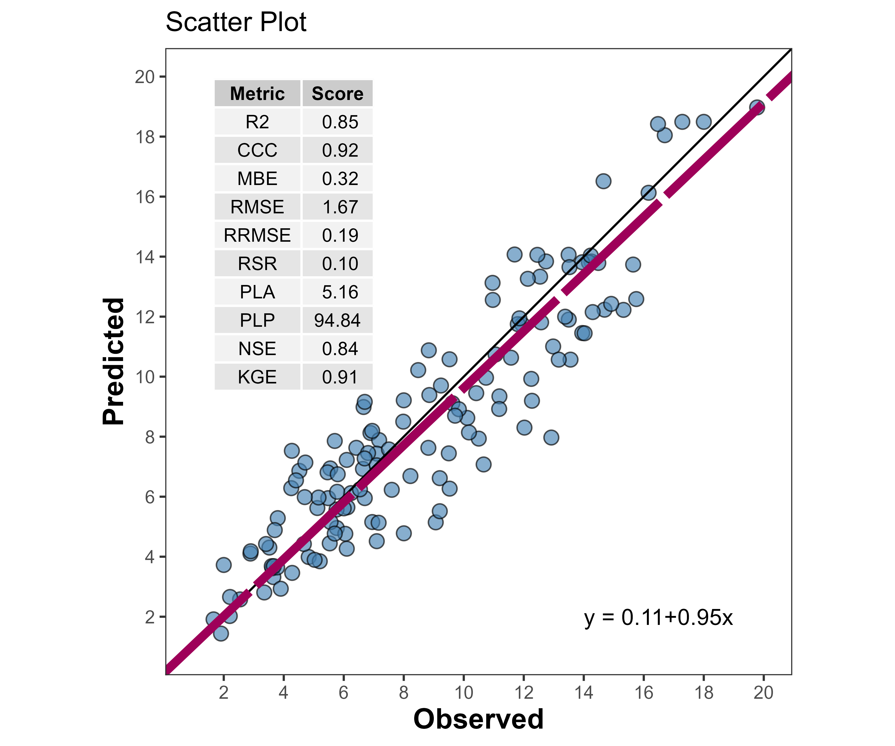

# Summary

{ width=24% align=left}

The *metrica* R package [@metrica_manual] is an open-source software designed to facilitate the quantitative and visual assessment of prediction performance of point-forecast simulation models for continuous (regression) and categorical variables (classification). The package ensembles a series of 80+ functions that account for multiple aspects of the agreement between predicted and observed values. Without the need of advanced skills on programming, *metrica* enables users to automate the estimation of multiple prediction performance metrics including goodness of fit, error metrics, error decomposition, model efficiency, indices of agreement, and to produce stylish data visualization outputs. This article introduces *metrica*, an R package developed with the main objective of contributing to transparent and reproducible evaluation of point-forecast models performance.

# Statement of need

Evaluating the prediction quality is a crucial step for any simulation model, for which a myriad of metrics and visualization techniques have been developed [@Tedeschi_2006; @Yang_2014; @Wallach_etal_2019]. Nonetheless, to conduct a comprehensive assessment of the predicted-observed agreement in R [@R_Core_Team], users normally have to rely on multiple packages, and even on self-defined functions, which increases the risk of involuntary mistakes due to the need of fluctuating syntax and data wrangling.

As the reproducibility of data analysis continues to be a challenge for science [@Seibold_2022], developing open source software like *metrica* offers a step toward a transparent and reproducible process to assist researchers in evaluating models performance. We decided to create *metrica* in R [@R_Core_Team] due to its substantial role in data science [@Thiem_2018]. Under its open-source philosophy, R empowers the democratization of statistical computing [@Hackenberger_2020] by hosting and globally distributing cutting-edge algorithms through the Comprehensive R Archive Network (CRAN).

Finally, it is noteworthy that in the area of agricultural sciences, although point-forecast simulation models such as the Agricultural Production Systems sIMulator (APSIM) [@APSIM_classic; @APSIM_nextgen] count with tools to facilitate the integration into R through packages such as apsimx [@apsimx_manual], the assessment of its prediction quality is not yet integrated for R users. Therefore, we aim for *metrica* to offer users of simulation models for agriculture, plant, and soil sciences community a toolbox for assessing the performance of regression and classification point-forecast models.

# Package features

For regression models, `metrica` includes four plotting functions (scatter, tiles, density, & Bland-Altman plots) using `ggplot2` [@ggplot_book], and 48 prediction performance metrics. For classification models (two-class or multi-class), it includes one function to visualize a confusion matrix, and 26 functions of prediction scores. The full list of metrics with description, formula, and literature sources is presented in the package documentation at:

- [Regression metrics vignette](https://adriancorrendo.github.io/metrica/articles/available_metrics_regression.html).

- [Classification metrics vignette](https://adriancorrendo.github.io/metrica/articles/available_metrics_classification.html).

To the best of our knowledge, *metrica* covers several functions not supported, or partially supported by similar R packages (or components) designed for model evaluation such as `yardstick` [@yardstick_manual] from `tidymodels` [@tidymodels_manual], the measuring performance components from `caret` [@caret_manual] or `mlr3` [@mlr3_paper], `Metrics` [@Metrics_manual], `hydroGOF` [@hydroGOF_manual], `cvms` [@cvms_package], `scoringutils`[@scoringutils_package], or `performance` [@performance_paper]. Unique features include:

- one of the most extensive collections of prediction performance metrics for regression and classification models in R.

- working under both vectorized (calling variables with $) or tabulated forms [@tidyverse_paper].

- controlling the output format as a list (`tidy = FALSE`) or as a table (`tidy = TRUE`).

- for classification, functions automatically recognizing two-class or multi-class data; and specifically for multi-class cases, several metrics can be estimated for each class (`atom = TRUE`)[@ferri2009], [@david2007], including balanced and imbalanced scenarios [@kubat1997].

- for regression, implementing a symmetric linear regression (standardized major axis-SMA-, [@Warton_2006]) to describe: i) pattern of the bivariate relationship with linear parameters (`B0_sma`, `B1_sma`), and ii) degree of predicted-observed agreement by using SMA-line to decompose the mean-squared-error (MSE) into lack of accuracy (`MLA`, `PLA`, `RMLA`) and lack of precision (`MLP`, `PLP`, `RMLP`) components [@CORRENDO2021_AgSyst].

- offering MSE decomposition approaches described by [@Kobayashi_Salam_2000] (`SB`, `SDSD`, `LCS`), and [@Smith_Rose_1995] (`Ub`, `Uc`, `Ue`).

- including multiple indices of agreement and model efficiency such as: i) index of agreement `d` [@Willmott_1981], and its modified `d1` [@Willmott_etal_1985] and refined `d1r` [@Willmott_etal_2012] variants, ii) Nash–Sutcliffe model efficiency (`NSE`) [@Nash_1970] and its improved variants `E1` [@Legates_1999], `Erel` [@Krause_2005], and Kling-Gupta model efficiency (`KGE`) [@Kling_etal_2012], iii) Robinson's index of agreement (RAC) [@Robinson_1957; @Robinson_1959], iv) Ji & Gallo agreement coefficient (AC) [@Ji_Gallo_2006], v) Duvellier's `lambda` [@Duveiller_2016], vi) distance correlation (`dcorr`) [@Szekely_2007], or vii)  maximal information coefficient (`MIC`) [@Reshef_2011]), among others.

- importing files from APSIM Classic with `import_apsim_out()`), and from APSIM Next Generation with the `import_apsim_db()` function.

## Using the functions

There are two core arguments to all *metrica* functions: (i) `obs` (Oi; observed, a.k.a. actual, measured, truth, target, label), and (ii) `pred` (Pi; predicted, a.k.a. simulated, fitted, modeled, estimate) values.

For regression, specific functions such as scatter_plot() require defining the axis `orientation` (*e.g.* predicted vs. observed -PO- or observed vs. predicted -OP-). For two-class models, the `pos_level` argument serves to indicate the alphanumeric order of the “positive level”. For multi-class classification, some functions present the `atom` argument (TRUE / FALSE), which controls the output to be an overall average estimate across all classes (default), or class-wise.

## Example 1: Regression (continuous variables)

Figure 1 is an output example of regression performance analysis using the scatter_plot() function for the native dataset called `wheat`.

### Example 2: Classification (categorical variables)

Figure 2 is an output example of classification performance analysis using the confustion_matrix() function for the native dataset called `maize_phenology`.

# Documentation & License

The complete documentation and vignettes of *metrica* are available online at [https://adriancorrendo.github.io/metrica/](https://adriancorrendo.github.io/metrica/). The package is under the MIT License ([https://opensource.org/licenses/MIT](https://opensource.org/licenses/MIT)). Source code is available at GitHub ([https://github.com/adriancorrendo/metrica](https://github.com/adriancorrendo/metrica)) along with its corresponding section to report issues and suggestions ([https://github.com/adriancorrendo/metrica/issues](https://github.com/adriancorrendo/metrica/issues)).

# Acknowledgements

Authors gratefully acknowledge the financial support from the Feed the Future Innovation Lab for Collaborative Research on Sustainable Intensification (SIIL) at Kansas State University through funding United States Agency for International Development (USAID) under the Cooperative Agreement (Grant number AID-OAA-L-14-00006).

# References
