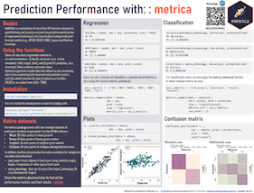

```{r, include = FALSE}
knitr::opts_chunk$set(
  collapse = TRUE,
  comment = "#>",
  fig.width=6, 
  fig.height=4
)
```

New users are encouraged to use the `metrica` cheatsheet. <br/>

The cheatsheet is available open-access in English, Spanish, Portuguese, and Russian languages at the RStudio [https://github.com/rstudio/cheatsheets](https://github.com/rstudio/cheatsheets)


