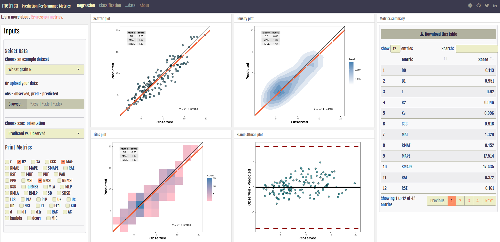

```{r, include = FALSE}
knitr::opts_chunk$set(
  collapse = TRUE,
  comment = "#>",
  fig.width=6, 
  fig.height=4
)
```

Users without any experience in R programming are highly encouraged to use the `metrica` web application designed with R shiny. The idea is to provide a simple demonstration of the package functions and capabilities. For both regression and classification data, users can either select an example dataset or load their own data (csv, xls, or xlsx). Outputs include estimates of all available performance metrics, download a file with a metrics summary, and produce a variety of predicted vs observed plots. <br/>

The app is organized into four tabs: (i) Regression: displaying the options for continuous data, (ii) Classification: displaying the options for categorical data, (iii) ...data: presenting a table with the loaded data by the user, and (iv) About: showing details about the app development and the `metrica` package. <br/>

The Shinyapp is available open-access here [https://ciampittilab.shinyapps.io/metrica/](https://ciampittilab.shinyapps.io/metrica/)



