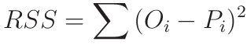
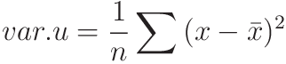
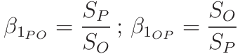
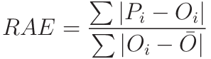
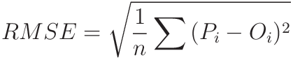
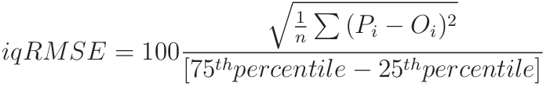
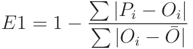
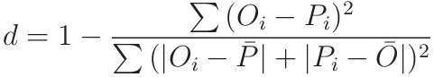
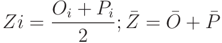

```{r setup, include = FALSE}
knitr::opts_chunk$set(
  collapse = TRUE,
  comment = "#>"
)
```

## Performance metrics available in *metrica*

The **metrica** package compiles +80 functions to assess regression (continuous) 
and classification (categorical) prediction performance from multiple perspectives. <br/> 

For regression models, it includes 4 plotting functions (scatter, tiles, density, 
& Bland-Altman plots), and 48 prediction performance scores including error metrics 
(MBE, MAE, RAE, RMAE, MAPE, SMAPE, MSE, RMSE, RRMSE, RSR, PBE, iqRMSE), 
model efficiency (NSE, E1, Erel, KGE), indices of agreement (d, d1, d1r, RAC, AC,
lambda), goodness of fit (r, R2, RSS, TSS, RSE), adjusted correlation coefficients
(CCC, Xa, distance correlation-dcorr-), error decomposition (MLA, MLP, PLA, PLP, 
PAB, PPB, SB, SDSD, LCS, Ub, Uc, Ue), variability (uSD, var_u), and symmetric 
regression coefficients (B0_sma, B1_sma). Specifically for time-series 
predictions, `metrica` also includes the Mean Absolute Scaled Error (MASE). <br/>

For classification (binomial and multinomial) tasks, it includes a function to 
visualize the confusion matrix using ggplot2, and 27 functions of prediction 
scores including: accuracy, error rate, precision, recall, specificity, 
balanced accuracy, F-score, adjusted F-score, G-mean, Bookmaker Informedness 
(Youden's J-index), Markedness (deltaP), Matthews Correlation Coefficient, 
khat or Cohen's Kappa, negative predictive value, positive and negative 
likelihood ratios, diagnostic odds ratio, prevalence, critical success index, 
false positive rate, false negative rate, false detection rate, false omission 
rate, and area under the ROC curve. <br/>

Always keep in mind the concept of "cross-validation" since predicted values 
should come from out-of-bag samples (unseen by training set) to avoid 
overestimation of the prediction performance. <br/>

## Core functions' arguments. <br/>

There are two basic arguments common to all `metrica` functions: 
(i) `obs`(Oi; observed, a.k.a. actual, measured, truth, target, label), and 
(ii) `pred` (Pi; predicted, a.k.a. simulated, fitted, modeled,  estimate) values. <br/>

Optional arguments include `data` that allows to call an existing data frame 
containing both observed and predicted vectors, and `tidy`, which controls the 
type of output as a list (tidy = FALSE) or as a data.frame (tidy = TRUE). <br/>

For regression, some specific functions for regression also require to define 
the axis `orientation`. For example, the slope of the symmetric linear regression 
describing the bivariate scatter (SMA). <br/>

For binary classification (two classes), functions also require to check the 
`pos_level` arg., which indicates the alphanumeric order of the "positive level".
Normally, the most common binary denominations are c(0,1), c("Negative", "Positive"), 
c("FALSE", "TRUE"), so the default pos_level = 2 (1, "Positive", "TRUE"). However, 
other cases are also possible, such as c("Crop", "NoCrop") for which the user
needs to specify pos_level = 1. <br/>

For multiclass classification tasks, some functions present the `atom` arg. (logical
TRUE / FALSE), which controls the output to be an overall average estimate across
all classes, or a class-wise estimate. For example, user might be interested in 
obtaining estimates of precision and recall for each possible class of the prediction. <br/>

## List of available prediction performance metrics <br/>

## 1. Regression metrics (continuous variables)

| #|Metric | Definition | Details | Formula |
| --|------ | ---------------|-------------------------- | ----------------------- |
| r01| `RSS` | Residual sum of squares (a.k.a. as sum of squares) | The sum of squared differences between predicted and observed values. It represents the base of many error metrics using squared scale such as the MSE | |
| r02| `TSS` | Total sum of squares | The sum of the squared differences between the observations and its mean. It is used as a reference error, for example, to estimate explained variance ||
| r03| `var_u` | Sample variance, uncorrected | The mean of sum of squared differences between values of an `x` and its mean (divided by n, not n-1)||
| r4| `uSD` | Sample standard deviation, uncorrected | The square root of the mean of sum of squared differences between values of an `x` and its mean (divided by n, not n-1)|| 
| r04| `B0` | Intercept of SMA regression | SMA is a symmetric linear regression (invariant results/interpretation to axis orientation) recommended to describe the bivariate scatter instead of OLS regression (classic linear model, which results vary with the axis orientation). B0 could be used to test agreement along with B1 (H0: B0 = 0, B1 = 1) . Warton et al. (2006) || 
| r06| `B1` | Slope of SMA regression |  SMA is a symmetric linear regression (invariant results/interpretation to axis orientation) recommended to describe the bivariate scatter instead of OLS regression (classic linear model, which results vary with the axis orientation). B1 could be used to test isometry of the PO scatter (H0: B1 = 1). B1 also represents the ratio of standard deviations (So and Sp). Warton et al. (2006) || 
| r07| `r` | Pearson's correlation coefficient |  Strength of linear association between P and O. However, it measures "precision" but no accuracy. Kirch (2008) || 
| r8| `R2` | Coefficient of determination |  Strength of linear association between P and O. However, it measures "precision" but no accuracy || 
| r09| `Xa` | Accuracy coefficient | Measures accuracy. Used to adjust the precision measured by `r` to estimate agreement || 
| r10| `CCC` | Concordance correlation coefficient | Tests agreement. It presents both precision (r) and accuracy (Xa) components. Easy to interpret. Lin (1989) ||
| r11| `MAE` | Mean Absolute Error |  Measures both lack of accuracy and precision in absolute scale. It keeps the same units than the response variable. Less sensitive to outliers than the MSE or RMSE. Willmott & Matsuura (2005) || 
| r12| `RMAE` | Relative Mean Absolute Error |  Normalizes the MAE with respect to the mean of observations || 
| r13| `MAPE` | Mean Absolute Percentage Error |  Percentage units (independent scale). Easy to explain and to compare performance across models with different response variables. Asymmetric and unbounded. || 
| r14| `SMAPE` | Symmetric Mean Absolute Percentage Error |  SMAPE tackles the asymmetry issues of MAPE and includes lower (0%) and upper (200%) bounds. Makridakis (1993) || 
| r15| `RAE` | Relative Absolute Error |  RAE normalizes MAE with respect to the total absolute error. Lower bound at 0 (perfect fit) and no upper bound (infinity) | |
| r16| `RSE` | Relative Squared Error |  Proportion of the total sum of squares that corresponds to differences between predictions and observations (residual sum of squares)| |
| r17| `MBE` | Mean Bias Error |  Main bias error metric. Same units as the response variable. Related to differences between means of predictions and observations. Negative values indicate overestimation. Positive values indicate underestimation. Unbounded. Also known as average error. Janssen & Heuberger (1995) | |
| r18| `PBE` | Percentage Bias Error |  Useful to identify systematic over or under predictions. Percentage units. As the MBE, PBE negative values indicate overestimation, while positive values indicate underestimation. Unbounded. Gupta et al. (1999) |  |
| r19| `PAB` | Percentage Additive Bias |  Percentage of the MSE related to systematic additive issues on the predictions. Related to difference of the means of predictions and observations |  |
| r20| `PPB` | Percentage Proportional Bias | Percentage of the MSE related to systematic proportionality issues on the predictions. Related to slope of regression line describing the bivariate scatter |  |
| r21| `MSE` | Mean Squared Error |  Comprises both accuracy and precision. High sensitivity to outliers |  |
| r22| `RMSE` | Root Mean Squared Error |  Comprises both precision and accuracy, has the same units than the variable of interest. Very sensitive to outliers |  |
| r23| `RRMSE` | Relative Root Mean Squared Error |  RMSE normalized by the mean of observations | |
| r24| `RSR` | Root Mean Standard Deviation Ratio | RMSE normalized by the standard deviation of observations. Moriasi et al. (2007) |  |
| r25| `iqRMSE` | Inter-quartile Normalized Root Mean Squared Error |  RMSE normalized by the interquartile range length (between percentiles 25th and 75th) |  |
| r26| `MLA` | Mean Lack of Accuracy | Bias component of MSE decomposition. Correndo et al. (2021) |  |
| r27| `MLP` | Mean Lack of Precision | Variance component of MSE decomposition. Correndo et al. (2021)  |  |
| r29| `PLA` | Percentage Lack of Accuracy |  Percentage of the MSE related to lack of accuracy (systematic differences) on the predictions. Correndo et al. (2021) |  |
| r29| `PLP` | Percentage Lack of Precision |  Percentage of the MSE related to lack of precision (unsystematic differences) on the predictions. Correndo et al. (2021) |  |
| r30| `SB` | Squared Bias |  Additive bias component, MSE decomposition. Kobayashi and Salam (2000) |  |
| r31| `SDSD` | Product of Standard Deviations | Proportional bias component,  MSE decomposition. Kobayashi and Salam (2000) |  |
| r32| `LCS` | Lack of Correlation |  Random error component, MSE decomposition. Kobayashi and Salam (2000) | |
| r33| `Ue` | Random error proportion | The Ue estimates the proportion of the total sum of squares related to the random error (unsystematic error or variance) following the sum of squares decomposition suggested by Smith and Rose (1995) also known as Theil's partial inequalities |  |
| r34| `Uc` | Lack of Consistency error proportion  |  The Uc estimates the proportion of the total sum of squares related to the lack of consistency (proportional bias) following the sum of squares decomposition suggested by Smith and Rose (1995) also known as Theil's partial inequalities |  |
| r35| `Ub` | Mean Bias error proportion |  The Ub estimates the proportion of the total sum of squares related to the mean bias following the sum of squares decomposition suggested by Smith and Rose (1995) also known as Theil's partial inequalities |  |
| r36| `NSE` | Nash and Sutcliffe's Model Efficiency |  Model efficiency using squared residuals normalized by the variance of observations. Nash and Sutcliffe (1970) |  |
| r37| `E1` | Absolute Model Efficiency |  Model efficiency. Modification of NSE using absolute residuals instead of squared residuals. Legates and McCabe (1999) |  |
| r38| `Erel` | Relative Model Efficiency |  Compared to the NSE, the Erel is suggested as more sensitive to systematic over- or under-predictions. Krause et al. (2005) | |
| r39| `KGE` | Kling-Gupta Model Efficiency |  Model efficiency with accuracy, precision, and consistency components. Kling et al. (2012) |  |
| r40| `d` | Index of Agreement |  Measures accuracy and precision using squared residuals. Dimensionless (normalized). Bounded [0;1]. Asymmetric Willmott (1981) |   |
| r41| `d1` | Modified Index of Agreement | Measures accuracy and precision using absolute residuals(1). Dimensionless (normalized). Bounded [0;1]. Asymmetric Willmott et al. (1985)  |  |
| r42| `d1r` | Refined Index of Agreement |  Refines d1 by a modification on the denominator (potential error) to normalize absolute error. Willmott et al. (2012) |  |
| r43| `RAC` | Robinson's Agreement Coefficient |  RAC measures both accuracy and precision (general agreement). Dimensionless (normalized). Bounded [0;1]. Symmetric. Robinson (1957; 1959) |  <br/> where <br/>  |
| r44| `AC` | Ji and Gallo's Agreement Coefficient |  AC measures both accuracy and precision (general agreement). Dimensionless (normalized). Positively bounded [-infinity;1]. Symmetric. Ji and Gallo (2006) | |
| r45| `lambda` | Duveiller's Lambda Coefficient | `lambda` measures both accuracy and precision. Dimensionless (normalized). Bounded [-1;1]. Symmetric. Equivalent to CCC when `r` is greater or equal to 0. Duveiller et al. (2016) |  <br/> where <br/> , <br/> otherwise <br/> |
| r46| `dcorr` | Distance correlation | Measures the dependency between to random vectors. Compared to Pearson's `r`, it offers the advantage of considering both linear and nonlinear association patterns. It is based on a matrix of centered Euclidean distances compared to the distance of many shuffles of the data. It is dimensionless, bounded [0;1], and symmetric. `dcorr = 0` characterizes independence between vectors. The closest to 1 the better. A disadvantage for the predicted-observed case is that values can be negatively correlated but producing a `dcorr` close to 1. Székely (2007) |  $dcorr = \sqrt{\frac{\mathcal{V}^2_n~(\mathbf{P,O})}{ {\sqrt{\mathcal{V}^2_n (\mathbf{P}) \mathcal{V}^2_n(\mathbf{O})} } }}$ See Székely (2007) for full details |
| r47| `MIC` | Maximal Information Coefficient | Measures association between two variables based on "binning" (a.k.a. data bucketing) to reduce the influence of small observation errors. It is based on the "mutual information" concept of information theory, which measures the mutual dependence between two variables. It is dimensionless (normalized), bounded [0;1], and symmetric. Reshef et al. (2011) |  See Reshef et al. 2011 |
| r48| `MASE` | Mean Absolute Scaled Error | The `MASE` is especially well suited for time series predictions, as it scales (or normalize) the error based on _in-sample_ MAE from the naive forecast method (a.k.a. random walk). It is dimensionless (normalized) and symmetric. The reference score is MASE = 1, which indicates that the model performs the same than a naive forecast (error with respect to previous historical observation). MASE <1 indicates that the model performs better than naive forecast, and MASE > 1 indicates a bad performance of the predictions. See Hyndman & Koehler (2006) |  $MASE = \frac{1}{n}(\frac{|O_i-P_i|}{ \frac{1}{T-1} \sum^T_{t=2}~|O_t - O_{t-1}| })$ |

<br/>

## 2. Classification metrics* (categorical variables)
_Note: All classification functions automatically recognize the number of classes and adjust estimations for binary or multiclass cases. However, for binary classification tasks, the user would need to check the alphanumeric order of the level considered as positive. By default "pos_level = 2" based on the most common denominations being c(0,1), c("Negative","Positive"), c("TRUE", "FALSE")._ <br/>

| #|Metric | Definition | Details | Formula |
| --|------ | ---------------|------------------------------------- | ---------- |
| c1| `accuracy` | Accuracy | It is the most commonly used metric to evaluate classification quality. It represents the number of corrected classified cases with respect to all cases. However, be aware that this metric does not cover all aspects about classification quality. When classes are uneven in number, it may not be a reliable metric. | $accuracy = \frac{TP+TN}{TP+FP+TN+FN}$|
| c2| `error_rate` | Error Rate | It represents the complement of accuracy. It could vary between 0 and 1. Being 0 the best and 1 the worst | $error~rate = \frac{FP+FN}{TP+FP+TN+FN}$|
| c3| `precision` | Precision | Also known as positive predictive value (PPV), it represents the proportion of well classified cases with respect to the total of cases predicted with a given class (multinomial) or the true class (binomial)  | $precision = \frac{TP}{TP + FP}$|
| c4| `recall` | Recall | Also known as sensitivity, hit rate, or true positive rate (TPR) for binary cases. It represents the proportion of well predicted cases with respect to the total number of observed cases for a given class (multinomial) or the positive class (binomial) | $recall = \frac{TP}{P} = 1 - FNR$| 
| c5| `specificity` | Specificity | Also known as selectivity or true negative rate (TNR). It represents the proportion of well classified negative values with respect to the total number of actual negatives  | $specificity = \frac{TN}{N} = 1 - FPR$|
| c6| `balacc` | Balanced Accuracy | This metric is especially useful when the number of observations across classes is imbalanced | $b.accuracy = \frac{recall + specificity}{2}$|
| c7| `fscore` | F-score | F1-score, F-measure | $fscore = \frac{(1 + B ^ 2) * precision * recall}{(B ^ 2 * precision) + recall)}$|
| c8| `agf` | Adjusted F-score | The agf adjusts the fscore for datasets with imbalanced classes | $agf = \sqrt{F_2 * invF_{0.5}}$, where $F_2 = 5 * \frac{recall~*~precision}{(4*recall)~+~precision}$, and $invF_{0.5} = (\frac{5}{4}) * \frac{recall~*~precision}{(0.5^2 ~*~ recall)~+~precision}$|
| c9| `gmean` | G-mean | The Geometric Mean (gmean) is a measure that considers a balance between the performance of both majority and minority classes. The higher the value the lower the risk of over-fitting of negative and under-fitting of positive classes | $gmean = \sqrt{recall~*~specificity}$|
| c10| `khat` | K-hat or Cohen's Kappa Coefficient | The khat is considered a more robust metric than the classic `accuracy`. It normalizes the accuracy by the possibility of agreement by chance. It is positively bounded to 1, but it is not negatively bounded. The closer to 1, the better the classification quality | $khat = \frac{2 * (TP * TN - FN * FP)}{(TP+FP) * (FP+TN) + (TP+FN) * (FN + TN)}$|
| c11| `mcc` | Matthews Correlation Coefficient | Also known as phi-coefficient. It is particularly useful when the number of observations belonging to each class is uneven. It varies between 0-1, being 0 the worst and 1 the best. Currently, the mcc estimation is only available for binary cases (two classes) | $mcc = \frac{TP * TN - FP * FN}{\sqrt{(TP+FP) * (TP+FN) * (TN+FP) * (TN+FN)}}$|
| c12| `fmi` | Fowlkes-Mallows Index | The fmi is a metric that measures the similarity between two clusters (predicted and observed). It is equivalent to the square root of the product between precision (PPV) and recall (TPR). It varies between 0-1, being 0 the worst and 1 the best.  | $fmi = \sqrt{precision * recall} = \sqrt{PPV * TPR}$ |
| c13| `bmi`| Informedness | Also known as the Bookmaker Informedness, or as the Youden's J-index. It is a suitable metric when the number of cases for each class is uneven. It varies between| $bmi = recall + specificity -1 = TPR + TNR - 1 = \frac{FP+FN}{TP+FP+TN+FN}$|
| c14| `posLr` | Positive Likelihood Ratio | The posLr, also known as LR(+) represents the odds of obtaining a positive prediction for actual positives. | $posLr = \frac{recall}{1+specificity} = \frac{TPR}{FPR}$|
| c15| `negLr` | Negative Likelihood Ratio | The negLr, also known as LR(-) indicates the odds of obtaining a negative prediction for actual positives (or non-negatives in multiclass) relative to the probability of actual negatives of obtaining a negative prediction | $negLr = \frac{1-recall}{specificity} = \frac{FNR}{TNR}$|
| c16| `dor` | Diagnostic Odds Ratio | The dor is a metric summarizing the effectiveness of classification. It represents the odds of a positive case obtaining a positive prediction result with respect to the odds of actual negatives obtaining a positive result| $dor = \frac{posLr}{negLr}$|
| c17| `npv` | Negative predictive Value | It represents the complement of accuracy. It could vary between 0 and 1. Being 0 the best and 1 the worst | $npv = \frac{TP}{PP} = \frac{TP}{TP + FP}$|
| c18| `FPR` | False Positive Rate | It represents the complement of `specificity`. It could vary between 0 and 1. The lower the better. | $FPR = 1 - specificity = 1 - TNR = \frac{FP}{N}$|
| c19| `FNR` | False Negative Rate | It represents the complement of `recall`. It could vary between 0 and 1. The lower the better. | $FNR = 1 - recall = 1 - TPR = \frac{FN}{P}$|
| c20| `FDR` | False Detection Rate | It represents the complement of `precision` (or positive predictive value -`PPV`-). It could vary between 0 and 1, being 0 the best and 1 the worst | $FDR = 1 - precision = \frac{FP}{PP} = \frac{FP}{TP + FP}$|
| c21| `FOR` | False Omission Rate | It represents the complement of the `npv`. It could vary between 0 and 1, being 0 the best and 1 the worst | $FOR = 1 - npv = \frac{FN}{PN} = \frac{FN}{TN + FN}$|
| c22| `preval` | Error Rate | It represents the complement of accuracy. It could vary between 0 and 1. Being 0 the best and 1 the worst | $error~rate = \frac{FP+FN}{TP+FP+TN+FN}$|
| c23| `preval_t` | Error Rate | It represents the complement of accuracy. It could vary between 0 and 1. Being 0 the best and 1 the worst | $error~rate = \frac{FP+FN}{TP+FP+TN+FN}$|
| c24| `csi` | Critical Success Index | The `csi` is also known as the threat score (TS). It could vary between 0 and 1, being 0 the worst and 1 the best | $csi = \frac{TP}{TP+FP+TN}$|
| c25| `deltap` | Markedness or deltap | The `deltap` is a metric that quantifies the probability that a condition is marked by the predictor with respect to a random chance | $deltap = precision+npv-1 = PPV + NPV -1$|
| c26| `AUC_roc` | Area Under the Curve | The `AUC_roc` estimates the area under the receiving operator characteristic curve following the trapezoid approach. It bounded between 0 and 1. The closet to 1 the better. AUC_roc = 0.5 means the models predictions are the same than a random classifier. | $AUC_{roc} = precision+npv-1 = PPV + NPV -1$|

<br/>

## 3. References: <br/>

## 3.1. Regression <br/>

01. Correndo et al. (2021). Revisiting linear regression to test agreement in continuous predicted-observed datasets. _Agric. Syst. 192, 103194._ \doi{10.1016/j.agsy.2021.103194} <br/>

02. Duveiller et al. (2016). Revisiting the concept of a symmetric index of agreement for continuous datasets. _Sci. Rep. 6, 1-14._ \doi{10.1038/srep19401} <br/>

03. Gupta et al. (1999). Status of automatic calibration for hydrologic models: Comparison with multilevel expert calibration. _J. Hydrologic Eng. 4(2): 135-143._ \doi{10.1061/(ASCE)1084-0699(1999)4:2(135) } <br/>

04. Janssen & Heuberger (1995). Calibration of process-oriented models. _Ecol. Modell. 83, 55-66._ \doi{10.1016/0304-3800(95)00084-9} <br/>

05. Ji & Gallo (2006). An agreement coefficient for image comparison. _Photogramm. Eng. Remote Sensing 7, 823–833._ \doi{10.14358/PERS.72.7.823} <br/>

06. Kling et al. (2012). Runoff conditions in the upper Danube basin under an ensemble of climate
change scenarios. _J. Hydrol., 424-425, 264-277._ \doi{10.1016/j.jhydrol.2012.01.011} <br/>

07. Kirch (2008). Pearson’s Correlation Coefficient. _In: Kirch W. (eds) Encyclopedia of Public Health. Springer, Dordrecht._ \doi{10.1007/978-1-4020-5614-7_2569} <br/>

08. Krause et al. (2005). Comparison of different efficiency criteria for hydrological model assessment. _Adv. Geosci. 5, 89–97._ \doi{10.5194/adgeo-5-89-2005} <br/>

09. Kobayashi & Salam (2000). Comparing simulated and measured values using mean squared deviation and its components. _Agron. J. 92, 345–352._ \doi{10.2134/agronj2000.922345x} <br/>

10. Legates & McCabe (1999). Evaluating the use of “goodness-of-fit” measures in hydrologic and hydroclimatic model validation. _Water Resour. Res._ \doi{10.1029/1998WR900018} <br/>

11. Lin (1989). A concordance correlation coefficient to evaluate reproducibility.
_Biometrics 45 (1), 255–268._ \doi{10.2307/2532051} <br/>

12. Makridakis (1993). Accuracy measures: theoretical and practical concerns. _Int. J. Forecast. 9, 527-529._ \doi{10.1016/0169-2070(93)90079-3} <br/>

13. Moriasi et al. (2007). Model Evaluation Guidelines for Systematic Quantification of Accuracy in
Watershed Simulations. _Trans. ASABE 50, 885–900._ \doi{10.13031/2013.23153} <br/>

14. Nash & Sutcliffe (1970). River flow forecasting through conceptual models part I - A discussion of principles. _J. Hydrol. 10(3), 292-290._ \doi{10.1016/0022-1694(70)90255-6} <br/>

15. Robinson (1957). The statistical measurement of agreement. _Am. Sociol. Rev. 22(1), 17-25._ \doi{10.2307/2088760} <br/>

16. Robinson (1959). The geometric interpretation of agreement. _Am. Sociol. Rev. 24(3), 338-345._ \doi{10.2307/2089382} <br/>

17. Smith & Rose (1995). Model goodness-of-fit analysis using regression and related
techniques. _Ecol. Model. 77, 49–64._ \doi{10.1016/0304-3800(93)E0074-D} <br/>

18. Warton et al. (2006). Bivariate line-fitting methods for allometry. _Biol. Rev. Camb. Philos. Soc. 81, 259–291._ \doi{10.1002/1521-4036(200203)44:2<161::AID-BIMJ161>3.0.CO;2-N} <br/>

19. Willmott (1981). On the validation of models. _Phys. Geogr. 2, 184–194._ \doi{10.1080/02723646.1981.10642213} <br/>

20. Willmott et al. (1985). Statistics for the evaluation and comparison of models. _J. Geophys. Res. 90, 8995._ \doi{10.1029/jc090ic05p08995} <br/>

21. Willmott & Matsuura (2005). Advantages of the mean absolute error (MAE) over the root mean square error (RMSE) in assessing average model performance. _Clim. Res. 30, 79–82._ \doi{10.3354/cr030079} <br/>

22. Willmott et al. (2012). A refined index of model performance. _Int. J. Climatol. 32, 2088–2094._  \doi{10.1002/joc.2419} <br/>

23. Yang et al. (2014). An evaluation of the statistical methods for testing the performance of crop models with observed data. _Agric. Syst. 127, 81-89._ \doi{10.1016/j.agsy.2014.01.008} <br/>

24. Szekely, G.J., Rizzo, M.L., and Bakirov, N.K. (2007). Measuring and testing dependence by correlation of distances. _Annals of Statistics, Vol. 35(6): 2769-2794._ \doi{10.1214/009053607000000505} <br/>

25. Reshef, D., Reshef, Y., Finucane, H., Grossman, S., McVean, G., Turnbaugh, P.,  Lander, R., Mitzenmacher, M., and Sabeti, P. (2011). Detecting novel associations in large datasets. _Science 334, 6062_. \doi{10.1126/science.1205438}

26. Hyndman, R.J., Koehler, A.B. (2006). Another look at measures of forecast accuracy. _Int. J. Forecast_ \doi{10.3354/cr030079}

<br/>

## 3.2. Classification <br/>

01. Ting K.M. (2017). Confusion Matrix. _In: Sammut C., Webb G.I. (eds) Encyclopedia of Machine Learning and Data Mining. Springer, Boston, MA._ \doi{10.1007/978-1-4899-7687-1_50}

02. (2017) Accuracy. _In: Sammut C., Webb G.I. (eds) Encyclopedia of Machine Learning and Data Mining_
_. Springer, Boston, MA._ \doi{10.1007/978-1-4899-7687-1_3}

03. García, V., Mollineda, R.A., Sánchez, J.S. (2009). Index of Balanced Accuracy: A Performance Measure for Skewed Class Distributions. _In: Araujo, H., Mendonça, A.M., Pinho, A.J., Torres, M.I. (eds) Pattern Recognition and Image Analysis. IbPRIA 2009. Lecture Notes in Computer Science, vol 5524. Springer-Verlag Berlin Heidelberg._ \doi{10.1007/978-3-642-02172-5_57}

04. Ting K.M. (2017). Precision and Recall. _In: Sammut C., Webb G.I. (eds) Encyclopedia of Machine Learning and Data Mining. Springer, Boston, MA._ \doi{10.1007/978-1-4899-7687-1_659}

05. (2017) Sensitivity. _In: Sammut C., Webb G.I. (eds) Encyclopedia of Machine Learning and Data Mining. Springer, Boston, MA._ \doi{10.1007/978-1-4899-7687-1_751}

06. Ting K.M. (2017). Sensitivity and Specificity. _In: Sammut C., Webb G.I. (eds) Encyclopedia of Machine Learning and Data Mining. Springer, Boston, MA._ \doi{10.1007/978-0-387-30164-8_752}

07. Trevethan, R. (2017). Sensitivity, Specificity, and Predictive Values: Foundations, Pliabilities, and Pitfalls in Research and Practice. _Front. Public Health 5:307_ \doi{10.3389/fpubh.2017.00307}

09. Goutte, C., Gaussier, E. (2005). A Probabilistic Interpretation of Precision, Recall and F-Score, with Implication for Evaluation. _In: D.E. Losada and J.M. Fernandez-Luna (Eds.): ECIR 2005. Advances in Information Retrieval LNCS 3408, pp. 345–359, 2. Springer-Verlag Berlin Heidelberg._ \doi{10.1007/978-3-540-31865-1_25}

10. Maratea, A., Petrosino, A., Manzo, M. (2014). Adjusted-F measure and kernel scaling for imbalanced data learning. _Inf. Sci. 257: 331-341._ \doi{10.1016/j.ins.2013.04.016}

11. De Diego, I.M., Redondo, A.R., Fernández, R.R., Navarro, J., Moguerza, J.M. (2022). General Performance Score for classification problems. _Appl. Intell. (2022)._ \doi{10.1007/s10489-021-03041-7}

12. Fowlkes, Edward B; Mallows, Colin L (1983). A method for comparing two hierarchical clusterings. _Journal of the American Statistical Association. 78 (383): 553–569._ \doi{10.1080/01621459.1983.10478008}

13. Chicco, D., Jurman, G. (2020). The advantages of the Matthews correlation coefficient (MCC) over F1 score and 
accuracy in binary classification evaluation. _BMC Genomics 21, 6 (2020)._ \doi{10.1186/s12864-019-6413-7}

14. Youden, W.J. (1950). Index for rating diagnostic tests. _Cancer 3: 32-35._ \doi{10.1002/1097-0142(1950)3:1<32::AID-CNCR2820030106>3.0.CO;2-3}

15. Powers, D.M.W. (2011). Evaluation: From Precision, Recall and F-Measure to ROC, Informedness, Markedness & Correlation. _Journal of Machine Learning Technologies 2(1): 37–63._ \doi{10.48550/arXiv.2010.16061}

16. Chicco, D., Tötsch, N., Jurman, G. (2021). The Matthews correlation coefficient (MCC) is more reliable than balanced accuracy, bookmaker informedness, and markedness in two-class confusion matrix evaluation. _BioData Min 14(1): 13._ \doi{10.1186/s13040-021-00244-z}

17. GlasaJeroen, A.S., Lijmer, G., Prins, M.H., Bonsel, G.J., Bossuyta, P.M.M. (2009). The diagnostic odds ratio: a single indicator of test performance. _Journal of Clinical Epidemiology 56(11): 1129-1135._ \doi{10.1016/S0895-4356(03)00177-X}

18. Wang H., Zheng H. (2013). Negative Predictive Value. _In: Dubitzky W., Wolkenhauer O., Cho KH., Yokota H. (eds) Encyclopedia of Systems Biology. Springer, New York, NY._ \doi{10.1007/978-1-4419-9863-7_234}

19. Freeman, E.A., Moisen, G.G. (2008). A comparison of the performance of threshold criteria for binary classification in terms of predicted prevalence and kappa. _Ecol. Modell. 217(1-2): 45-58._ \doi{10.1016/j.ecolmodel.2008.05.015}
 
20. Balayla, J. (2020). Prevalence threshold (φe) and the geometry of screening curves. _Plos one, 15(10):e0240215._ \doi{10.1371/journal.pone.0240215}

21. Schaefer, J.T. (1990). The critical success index as an indicator of warning skill. Weather and Forecasting 5(4): 570-575. \doi{10.1175/1520-0434(1990)005<0570:TCSIAA>2.0.CO;2}

22. Hanley, J.A., McNeil, J.A. (2017). The meaning and use of the area under a receiver operating characteristic (ROC) curve. _Radiology 143(1): 29-36_ \doi{10.1148/radiology.143.1.7063747}

23. Hand, D.J., Till, R.J. (2001). A simple generalisation of the area under the ROC curve for multiple class
classification problems. _Machine Learning 45: 171-186_ \doi{10.1023/A:1010920819831}  

24. Mandrekar, J.N. (2010). Receiver operating characteristic curve in diagnostic test assessment. _J. Thoracic Oncology 5(9): 1315-1316_ \doi{10.1097/JTO.0b013e3181ec173d} 


