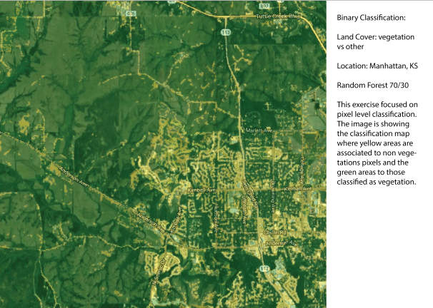
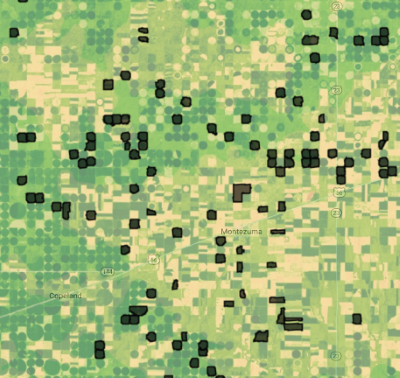

```{r setup, include = FALSE}
knitr::opts_chunk$set(
  collapse = TRUE,
  comment = "#>"
)
```

## 1. Introduction 
 <br/>
The *`metrica`* package was developed to visualize and compute the level of agreement between observed ground-truth values and model-derived (e.g., mechanistic or empirical) predicted. 

This package is intended to fit into the following workflow:  

1. a data set containing the observed values is used to train a model  
2. the trained model is used to generate predicted  
3. a data frame containing at least the **observed** and model-**predicted** values is created  
4. *`metrica`* package is used to compute and evaluate the classification model based on observed and predicted values  
5. *`metrica`* package is used to visualize model fit and selected fit metrics  

This vignette introduces the functionality of the *`metrica`* package applied to observed and model-predicted values of a binary land cover classification scenario, where the two classes are vegetation (1) and non-vegetation (0)).  

Let's begin by loading the packages needed.  <br/>
## Libraries 
```{r warning=FALSE, message=FALSE}
library(metrica)
library(dplyr)
library(purrr)
library(tidyr)
```

## 2. Example datasets  <br/>

### 2.1. Kansas Land Cover data 

<br/>

 

<br/>

Now we load the binary `land_cover` data set already included with the `metrica` package. This data set contains two columns:  <br/>

- `predicted`: model-predicted (random forest) land cover, being vegetation = 1 and other = 0,  <br/>

- `actual`: ground-truth observed land cover, being 0 = vegetation and 1 = other <br/>

```{r load binary data}
# Load
binary_landCover <- metrica::land_cover

# Printing first observations
head(binary_landCover)
```

### 2.2. Maize Phenology 

<br/>

 

<br/>

Now we load the multinomial `maize_phenology` data set, which is also already included with the `metrica` package. This multiclass data set presents 16 different classes corresponding to phenological stages of the maize (*Zea Mays* (L.)) crop.  <br/>

```{r load multiclass data}
# Load
multi_maize_phen <- metrica::maize_phenology

# Printing first observations
head(multi_maize_phen)
```


## 3 Visual assessment of agreement <br/>

### 3.1 Confusion matrix  

The simplest way to visually assess agreement between observed and predicted classes is with a confusion matrix.  <br/>

We can use the function `confusion_matrix()` from the *metrica* package.  <br/>

The function requires specifying:  <br/>

- the data frame object name (`data` argument) <br/>

- the name of the column containing observed values (`obs` argument)  <br/>

- the name of the column containing predicted values (`pred` argument)  <br/>

The output of the `confusion_matrix()` function is either a table (`plot = FALSE`) or
a `ggplot2` object (`plot = TRUE`) that can be further customized: <br/>

### 3.1. Binary

```{r confusion_matrix binary, fig.width=6, fig.height=5, dpi=120}
# a. Print
binary_landCover %>% confusion_matrix(obs = actual, pred = predicted, 
                                      plot = FALSE,
                                      unit = "count")

# b. Plot
binary_landCover %>% confusion_matrix(obs = actual, pred = predicted, 
                                      plot = TRUE,
                                      colors = c(low="#ffe8d6" , high="#892b64"), 
                                      unit = "count")

# c. Unit = proportion
binary_landCover %>% confusion_matrix(obs = actual, pred = predicted, 
                                      plot = TRUE,
                                      colors = c(low="#f9dbbd" , high="#892b64"), 
                                      unit = "proportion")

```

### 3.2. Multiclass

```{r confusion_matrix multiclass, fig.width=9, fig.height=7, dpi=120}  
# a. Print
multi_maize_phen %>% confusion_matrix(obs = actual, pred = predicted, 
                                      plot = FALSE, 
                                      unit = "count")

# b. Plot
multi_maize_phen %>% confusion_matrix(obs = actual, pred = predicted, 
                                      plot = TRUE, 
                                      colors = c(low="grey85" , high="steelblue"), 
                                      unit = "count")

```


## 4. Numerical assessment of agreement  <br/>

The *metrica* package contains functions for **26** scoring rules to assess the agreement between observed and predicted values for classification data.  <br/>

A list with all the the metrics including their name, definition, details, formula, and function name, please check [here](https://adriancorrendo.github.io/metrica/articles/available_metrics.html).  <br/>

All of the metric functions take at least three arguments:  <br/>

- the data frame object name (`data` argument, optional) <br/>

- the name of the column containing observed values (`obs` argument)  <br/>

- the name of the column containing predicted values (`pred` argument) <br/>

- an integer (1 or 2) indicating the alphanumerical order of the positive event (`pos_level` argument, Default = 2) <br/>

- a TRUE/FALSE indicating to estimate metrics for each single class (`atom` argument, Default = FALSE). This argument is only functional for multiclass datasets. <br/>

- a TRUE/FALSE indicating to store the numeric result as a list (`tidy` argument, Default = FALSE), or as a data frame (tidy = TRUE). <br/>

### 4.1. Single metrics

The user can choose to calculate a single metric, or to calculate all metrics at once.  <br/>

To calculate a single metric, the metric function can be called. For example, to calculate $accuracy$, we can use the `accuracy()` function:  

```{r accuracy}
# Binary
binary_landCover %>% accuracy(data = ., obs = actual, pred = predicted, tidy = TRUE)

# Multiclass
maize_phenology %>% accuracy(data = ., obs = actual, pred = predicted, tidy = TRUE)
```

Or considering imbalanced observations across classes we can call the `balacc()` function for balanced accuracy:

```{r balanced_accuracy}
# Binary
binary_landCover %>% balacc(data = ., obs = actual, pred = predicted, tidy = TRUE)

# Multiclass
maize_phenology %>% balacc(data = ., obs = actual, pred = predicted, tidy = TRUE)
```

Similarly, to calculate precision, we can use the `precision()` function:  <br/>

```{r precision}
# Binary
binary_landCover %>% precision(data = ., obs = actual, pred = predicted, tidy = TRUE)

# Multiclass
maize_phenology %>% precision(data = ., obs = actual, pred = predicted, tidy = TRUE)
```

### 4.2. Metrics summary

The user can also calculate all metrics at once using the function `metrics_summary()`:  <br/>
``` {r metrics_summary}

# Get all at once with metrics_summary()
# Binary
binary_landCover %>% metrics_summary(data = ., obs = actual, pred = predicted, type = "classification")

# Multiclass
multi_maize_phen %>% metrics_summary(data = ., obs = actual, pred = predicted, type = "classification")
```

Alternatively, if the user is only looking for specific metrics, within the same function `metrics_summary()`, the user can pass a list of desired metrics using the argument "metrics_list" as follows: <br/>  

``` {r metrics_summary_selected}  
# Get a selected list at once with metrics_summary()
selected_class_metrics <- c("accuracy", "precision", "recall", "fscore")

# Binary
bin_sum <- binary_landCover %>% 
  metrics_summary(data = ., 
                  obs = actual, pred = predicted, 
                  type = "classification",
                  metrics_list = selected_class_metrics, pos_level = 1) 

# Multiclass
multi_maize_phen %>% 
  metrics_summary(data = ., 
                  obs = actual, pred = predicted, 
                  type = "classification",
                  metrics_list = selected_class_metrics)

```

### 4.3. Multiple models

In some cases, multiple runs of a model are available to compare vs. observed values (e.g. cross-validation folds). Thus, we can also fit the agreement analysis for several datasets as follows: <br/>

```{r multiple_models nested}

set.seed(15)
# Let's simulated two extra runs of the same model for Land Cover
fold_2 <- data.frame(actual = sample(c(0,1), 285, replace = TRUE),
                     predicted = sample(c(0,1), 285, replace = TRUE))
fold_3 <- data.frame(actual = sample(c(0,1), 285, replace = TRUE),
                     predicted = sample(c(0,1), 285, replace = TRUE))

# a. Create nested df with the folds
binary_nested_folds <- bind_rows(list(fold_1 = binary_landCover, 
                                      fold_2 = fold_2,
                                      fold_3 = fold_3),
                             .id = "id") %>%
  dplyr::group_by(id) %>% tidyr::nest()

head(binary_nested_folds %>% group_by(id) %>% dplyr::slice_head(n=2))

# b. Run 
binary_folds_summary <- binary_nested_folds %>% 
  # Store metrics in new.column "performance"
  dplyr::mutate(performance = 
                  purrr::map(data,
                             ~metrica::metrics_summary(data = ., 
                                                       obs = actual, pred = predicted, 
                                                       type = "classification"))) %>% 
  dplyr::select(-data) %>% 
  tidyr::unnest(cols = performance) %>% 
  dplyr::arrange(Metric)

head(binary_folds_summary)

```

#### 4.3.1. Non-nested data <br/>

#### 4.3.1.1. Using `group_map()` <br/>

```{r multiple_models unnested group_map}
non_nested_folds <- binary_nested_folds %>% unnest(cols = "data") 

# Using group_map()
binary_folds_summary_2 <- non_nested_folds %>% 
  dplyr::group_by(id) %>% 
  dplyr::group_map(~metrics_summary(data = ., obs = actual, pred = predicted, type = "classification"))

binary_folds_summary_2
```

#### 4.3.1.2. Using `summarise()` <br/>

```{r multiple_models unnested summarise}

# Using summarise()
binary_folds_summary_3 <- non_nested_folds %>% 
  dplyr::group_by(id) %>% 
  dplyr::summarise(metrics_summary(obs = actual, pred = predicted, type = "classification")) %>%
  dplyr::arrange(Metric)


binary_folds_summary_3

```
## 5. Visual Assessment <br/>

### 5.1. Customizing the confusion matrix <br/>

To print the metrics on the `confusion_matrix()`, just use print.metrics = TRUE. Warning: do not forget to specify your 'metrics.list' and choice wisely: <br/>  

```{r scatter_plot print_metrics, fig.width=9, fig.height=7, dpi=120}

selected_metrics <- c("accuracy", "precision", "recall", "khat",
                   "mcc", "fscore", "agf", "npv", "FPR", "FNR")

binary_matrix_metrics <- 
  binary_landCover %>% 
  confusion_matrix(obs = actual, pred = predicted, 
                   plot = TRUE,
                   colors = c(low="#ffe8d6" , high="#892b64"), 
                   unit = "count",  
                   # Print metrics_summary
                   print_metrics = TRUE,
                   # List of performance metrics
                   metrics_list = selected_metrics,
                   # Position (bottom or top)
                   position_metrics = "bottom")

binary_matrix_metrics

multinomial_matrix_metrics <-
  maize_phenology %>% 
  confusion_matrix(obs = actual, pred = predicted, 
                   plot = TRUE, 
                   colors = c(low="grey85" , high="steelblue"), 
                   unit = "count",
                   # Print metrics_summary
                   print_metrics = TRUE,
                   # List of performance metrics
                   metrics_list = selected_metrics,
                   # Position (bottom or top)
                   position_metrics = "bottom")
  
multinomial_matrix_metrics

```
Also, as a ggplot element, outputs are flexible of further edition:  

```{r scatter_plot.edit, fig.width=9, fig.height=7, dpi=120}

binary_matrix_metrics +
  # Modify labels
  ggplot2::labs(x = "Observed Vegetation", 
       y = "Predicted Vegetation",
       title = "Binary Confusion Matrix")
  

multinomial_matrix_metrics +
  # Modify labels
  ggplot2::labs(x = "Observed Corn Phenology", 
       y = "Predicted Corn Phenology",
       title = "Multinomial Confusion Matrix")+
  # Modify theme
  ggplot2::theme_light()


```


## 6. Exporting  
To export the metrics summary table, the user can simply write it to file with the function `write.csv()`:  

```{r export metrics_summary, eval=F }
metrics_summary(data = binary_landCover,
                obs = obs, 
                pred = pred,
                type = "classification") %>%
  write.csv("binary_landcover_metrics_summary.csv")

```


Similarly, to export a plot, the user can simply write it to file with the function `ggsave()`:  

```{r export plot, eval=F}

ggsave(plot = multinomial_matrix_metrics,
       "multinomial_matrix_metrics.png",
       width = 8,
       height = 7)
```
